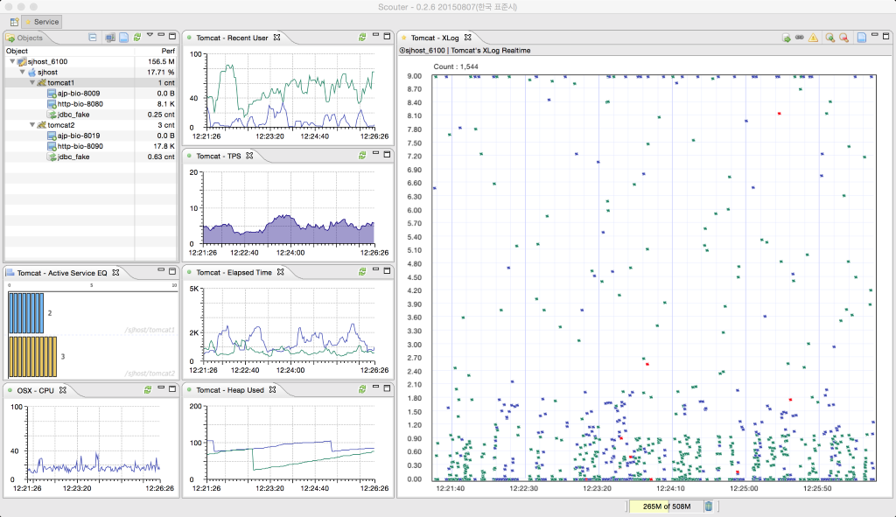

 

## Application Performance Monitoring for Open Source S/Ws.
SCOUTER is an open source APM like new relic and appdynamics.
(APM means application performance monitoring or application performance management.)

 - **Monitoring targets (from scouter agent)**
   - Java Agent : Web application (on Tomcat, JBoss, Resin ...), Standalone java application
   - Host Agent : Linux, Windows, Unix

 - **Monitoring targets (from Telegraf support) Since @2.0.0**
   - Redis, nginX, apache httpd, haproxy, Kafka, MySQL, MongoDB, RabbitMQ, ElasticSearch, Kube, Mesos ...

 - **Monitoring targets (from Zipkin-Scouter storage) Since @2.5.0**
   - Any zipkin instrumentations(C#, Go, Python, Javascript, PHP...) can be shown in a XLog(Scatter) chart. 
   - see the [zipkin-scouter-storage](https://github.com/scouter-project/zipkin-scouter) documentation.
   - see the [zipkin instrumentations.](https://zipkin.io/pages/extensions_choices.html)  
  

Users use application services on a system and the services use resources on the system.
You should understand this context in order to manage the system performance efficiently.
SCOUTER can help you.

- **SCOUTER shows**
  - Metrics about users : Active user, Recently used user, Today visitor
  - Metrics about services : Active service, TPS, Response time, Application profiles(method profile, sql profile, external call profile...)
  - Metrics about resources : Cpu, Memory, Network and Heap usage, Connection pools etc.

## At a glance(Click to watch the video)

## Documents
 - [Document home](./scouter.document/index.md)
 - [Quick start guide (Quick Installation of demo system)](./scouter.document/main/Quick-Start.md)
 - [Installation](./scouter.document/main/Setup.md)
 - [Live demo](./scouter.document/main/Live-Demo.md)
 - [How to analyze XLog View](./scouter.document/client/Reading-XLog.md)
 - [Customizable alarm - Alert plugins guide](./scouter.document/main/Alert-Plugin-Guide.md)
 - [Telegraf server feature](./scouter.document/main/Telegraf-Server.md)
 - [Client screen help](./scouter.document/client/How-To-Use-Client.md)

## Download
 - [Latest Release](https://github.com/scouter-project/scouter/releases/)

## Modules
### Official modules:

- **Agent** : gather performance information and send to the server
  - **Java Agent (JVM Agent)** : gathering profiles and performance metrics of JVM & Web application server(eg. Tomcat)...
  - **Host Agent (OS Agent)** : gathering performance metrics of Linux, Windows and OSX...
  - **MariaDB Agent** : [to be announced]

- **Server (Collector)** : save the performance metrics from scouter agents or telegraf. The data is streamed to scouter client.

- **Client (Viewer)** : client program based on RCP. (not support OSX Big Sur.)

- **Web API (Since @1.8.0)** : scouter web apis to get counters, XLogs, profiles and another performance metrics via HTTP protocol.
  - [Web API Guide](./scouter.document/tech/Web-API-Guide.md)
  
- **Weaver (Since @2.17.0)** : Provides the ability to directly control Scouter XLog and Profiles at the code level of Java applications.
  - [Scouter Weaver Guide](./scouter.document/weaver/Weaver-Guide.md)

### 3rd-party UIs
- **scouter paper** : [scouter paper homepage](https://scouter-contrib.github.io/scouter-paper/)
  - **showcase** : [scouter paper overview (youtube)](https://www.youtube.com/watch?v=NjJ0dGhdIbU)  

### Plugins
- **Server plugin**
  - **Sample**
    - **[scouter-plugin-server-null](https://github.com/scouter-project/scouter-plugin-server-null)** : sample plugin prints out data collected
  
  - **Alert**
    - **[scouter-plugin-server-email](https://github.com/scouter-contrib/scouter-plugin-server-alert-email)** : emails alerts from Scouter
    - **[scouter-plugin-server-telegram](https://github.com/scouter-contrib/scouter-plugin-server-alert-telegram)** : transfer alerts from Scouter to telegram
    - **[scouter-plugin-server-slack](https://github.com/scouter-contrib/scouter-plugin-server-alert-slack)** : transfer alerts from Scouter to slack
    - **[scouter-plugin-server-line](https://github.com/scouter-contrib/scouter-plugin-server-alert-line)** : transfer alerts from Scouter to line
    - **[scouter-plugin-server-dingtalk](https://github.com/scouter-contrib/scouter-plugin-server-alert-dingtalk)** : transfer alerts from Scouter to dingtalk
    - **[scouter-plugin-server-teams](https://github.com/scouter-contrib/scouter-plugin-server-alert-teams)** : transfer alerts from Scouter to Microsoft Teams
    
  - **Counter** 
    - **[scouter-plugin-server-influxdb](https://github.com/scouter-contrib/scouter-plugin-server-influxdb)** : transfer performance data from Scouter to influxDB(time series DB)  

- **Agent plugin**
  - TBD

### 3rd-party Agent
- **Pulse type agent** : [scouter-pulse-library](https://github.com/scouter-contrib/scouter-pulse)
  - **[aws-monitor](https://github.com/nices96/scouter-pulse-aws-monitor)** : gathering performance metrics of EC2, RDS, ELB from cloudwatch in AWS.

 

## Facebook
 - [Scouter APM : Facebook Scouter user group](https://www.facebook.com/groups/scouterapm/)

## How to contribute
 - **Notice** : Pull request to **develop branch** only allowed.
 - Refer to the development guide below.
   - [Scouter developer guide](./scouter.document/tech/Developer-Guide.md)
 - Please note that you will have to complete a [CLA](http://goo.gl/forms/xSmYs8qM9J) for your first pull-request.

## Q&A
 - [Google Groups](https://groups.google.com/forum/#!forum/scouter-project)

## Blogging & Posts
 - [Scouter series #1 - Installation](https://translate.google.co.kr/translate?hl=ko&sl=ko&tl=en&u=https%3A%2F%2Fgunsdevlog.blogspot.kr%2F2017%2F07%2Fscouter-apm-1.html)
 - [Scouter series #2 - basic monitoring(1/2)](https://translate.google.co.kr/translate?hl=ko&sl=ko&tl=en&u=https%3A%2F%2Fgunsdevlog.blogspot.kr%2F2017%2F07%2Fscouter-apm-2-12.html)
 - [Scouter series #2.1 - basic monitoring(2/2)](https://translate.google.co.kr/translate?hl=ko&sl=ko&tl=en&u=https%3A%2F%2Fgunsdevlog.blogspot.kr%2F2017%2F07%2Fscouter-apm-basic-monitoring-2.html)
 - [Scouter series #3 - Active service & XLog](https://translate.google.co.kr/translate?hl=ko&sl=ko&tl=en&u=http%3A%2F%2Fgunsdevlog.blogspot.kr%2F2018%2F05%2Fscouter-apm-xlog-howto.html)
 - [Scouter series #4 - XLog details](https://translate.google.co.kr/translate?hl=ko&sl=ko&tl=en&u=http%3A%2F%2Fgunsdevlog.blogspot.kr%2F2018%2F05%2Fscouter-apm-active-service-xlog.html)
 - [Scouter series #5 - Customizable alert](https://translate.google.co.kr/translate?hl=ko&sl=ko&tl=en&u=http%3A%2F%2Fgunsdevlog.blogspot.kr%2F2018%2F05%2Fscouter-customizable-alert.html)
 - [Applying Scouter APM to my service : by Kingbbode](https://translate.google.co.kr/translate?hl=ko&sl=ko&tl=en&u=http%3A%2F%2Fkingbbode.tistory.com%2F12)
 - [Effective monitoring by Scouter : by TMON](https://translate.google.co.kr/translate?hl=ko&sl=ko&tl=en&u=http%3A%2F%2Fblog.naver.com%2FPostView.nhn%3FblogId%3Dtmondev%26logNo%3D220870505665)
 - [Opensource performance monitoring, Scouter configurations : by SUN](https://translate.google.co.kr/translate?hl=ko&sl=ko&tl=en&u=http%3A%2F%2Fwww.popit.kr%2Fscouter-open-source-apm-config%2F)
 - [Scouter, InfluxDB, Grafana](https://translate.google.co.kr/translate?hl=ko&sl=ko&tl=en&u=https%3A%2F%2Fgunleeblog.wordpress.com%2F2016%2F04%2F01%2Fopen-source-apm-scouter-influxdb-grafana-%25EC%2597%25B0%25EB%258F%2599-step-by-step%2F)
 - [Build my own agents by scouter pulse](https://translate.google.co.kr/translate?hl=ko&sl=ko&tl=en&u=https%3A%2F%2Fgunleeblog.wordpress.com%2F2016%2F09%2F07%2Fscouter-pulse%25EB%25A5%25BC-%25EC%259D%25B4%25EC%259A%25A9%25ED%2595%2598%25EC%2597%25AC-%25EB%2582%2598%25EB%25A7%258C%25EC%259D%2598-agent-%25EB%25A7%258C%25EB%2593%25A4%25EA%25B8%25B0%2F)
 - [Quick installation of scouter paper UI](https://gunsdevlog.blogspot.kr/2018/04/scouter-web-ui-paper.html)

 
 
## License
Licensed under the Apache License, Version 2.0
 

