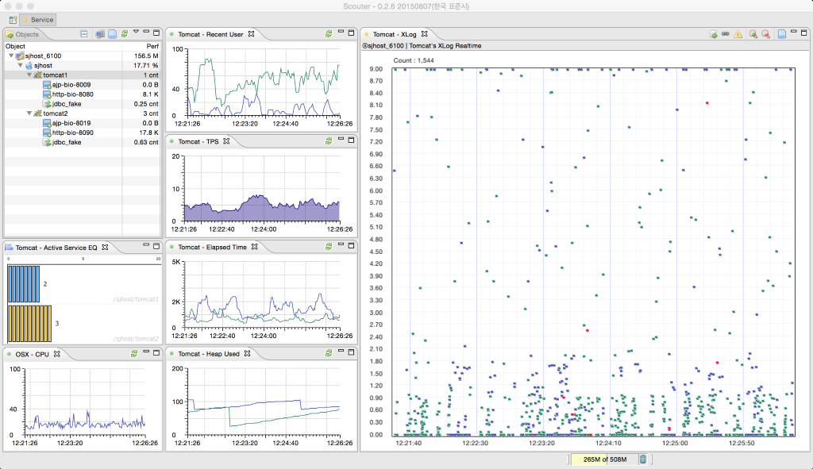

 

 

## 어플리케이션 성능 모니터링

오픈소스 APM인 Scouter는 JVM(WAS, Standalone application)을 사용하는 어플리케이션 및 OS 자원에 대한 모니터링 모니터링 기능을 제공한다.
 - **APM** : Application performance montoring / application performance management
 - 모니터링 대상 (전용 agent)
   - Java Agent : Web application (on Tomcat, JBoss, Resin ...), Standalone java application
   - Host Agent : Linux, Windows, Unix
 - 모니터링 대상 (Telegraf support)
   - Redis, nginX, apache httpd, haproxy, Kafka, MySQL, MongoDB, RabbitMQ, ElasticSearch, Kube, Mesos ...
- 모니터링 대상 (Zipkin-Scouter storage)
  - zipkin instrumentations (C#, Go, Python, Javascript, PHP...)를 XLog 차트를 통해 디스플레이합니다.
  - see the [zipkin-scouter-storage](https://github.com/scouter-project/zipkin-scouter) documentation.
  - see the [zipkin instrumentations.](https://zipkin.io/pages/existing_instrumentations.html)  

사용자는 시스템에 서비스 요청을 보내고, 이를 통해 서비스는 시스템의 자원을 사용하게 된다.
시스템 성능을 잘 이해하고 관리하기 위해서는 사용자와 서비스, 자원간의 관계를 이해하고 접근하는 것이 중요하며 SCOUTER를 활용하여 보다 쉽게 이에 대한 접근이 가능하다.

- SCOUTER의 주요 모니터링 항목 :
  - 사용자 : Active User, Recent User, Today Visitor 등
  - 서비스 : Active Service, TPS, Response Time, Transaction Profile(class,sql,apicall) 등
  - 자원 : Cpu, Memory, Network and Heap usage, Connection pool 등.

## 소개 동영상(클릭)

## Documents
 - [Document Home](./scouter.document/index_kr.md)
 - [Quick Start(Scouter Demo 설치)](./scouter.document/main/Quick-Start_kr.md)
 - [Scouter 설치](./scouter.document/main/Setup_kr.md)
 - [Live demo 접속](./scouter.document/main/Live-Demo_kr.md)
 - [XLog 로 분석하기](./scouter.document/client/Reading-XLog_kr.md)
 - [사용자 정의 알람 스크립팅 - Alert plugins guide](./scouter.document/main/Alert-Plugin-Guide_kr.md)
 - [Telegraf server feature](./scouter.document/main/Telegraf-Server_kr.md)
 - [Client 화면 설명](./scouter.document/client/How-To-Use-Client_kr.md)

## Download
 - [최신 Release](https://github.com/scouter-project/scouter/releases/)

## 모듈
### 스카우터는 4가지 주요 모듈로 구성된다 :

- **Agent** : 성능 데이터를 수집하여 수집 서버로 전송
  - **Tomcat Agent (Java Agent)** : JVM 과 Tomcat WAS 성능 수집
  - **Host Agent (OS Agent)** : Linux, Windows 및 OSX 성능
  -  **MariaDB Agent** : [to be announced]

- **Server (Collector)** : Agent가 전송한 데이터를 저장하고 Client 요청시 Client에게 적절한 데이터를 전송

- **Client (Viewer)** : 수집된 데이터를 보기 위한 RCP 기반 Client 프로그램. (OSX Big Sur 미지원)

- **Web API (Since @1.8.0)** : 성능 카운터, XLog, 프로파일등의 정보를 HTTP 프로토콜을 통해 제공
  - [Web API Guide](./scouter.document/tech/Web-API-Guide_kr.md)

- **Weaver (Since @2.17.0)** : Java 애플리케이션의 코드 수준에서 Scouter XLog와 Profile을 직접 제어하는 기능 제공

### 3rd-party UIs
- **scouter paper** : [scouter-paper homepage](https://scouter-contrib.github.io/scouter-paper/)
  - **showcase** : [scouter paper overview](https://www.youtube.com/watch?v=NjJ0dGhdIbU)  

  

### Plugins
- **Server plugin**
  - **Sample**
    - **[scouter-plugin-server-null](https://github.com/scouter-project/scouter-plugin-server-null)** : 수집데이터를 단순히 출력해 주는 sample plugin
    
  - **Alert**
    - **[scouter-plugin-server-null](https://github.com/scouter-contrib/scouter-plugin-server-null)** : 수집데이터를 단순히 출력해 주는 sample plugin
    - **[scouter-plugin-server-email](https://github.com/scouter-contrib/scouter-plugin-server-alert-email)** : Scouter에서 발생하는 alert를 email로 전송하는 plugin
    - **[scouter-plugin-server-telegram](https://github.com/scouter-contrib/scouter-plugin-server-alert-telegram)** : Scouter에서 발생하는 alert를 telegram으로 전송하는 plugin
    - **[scouter-plugin-server-slack](https://github.com/scouter-contrib/scouter-plugin-server-alert-slack)** : Scouter에서 발생하는 alert를 slack으로 전송하는 plugin
    - **[scouter-plugin-server-line](https://github.com/scouter-contrib/scouter-plugin-server-alert-line)** : Scouter에서 발생하는 alert를 line으로 전송하는 plugin
    - **[scouter-plugin-server-dingtalk](https://github.com/scouter-contrib/scouter-plugin-server-alert-dingtalk)** : Scouter에서 발생하는 alert를 dingtalk으로 전송하는 plugin
    - **[scouter-plugin-server-teams](https://github.com/scouter-contrib/scouter-plugin-server-alert-teams)** : Scouter에서 발생하는 alert를 Microsoft Teams 로 전송하는 plugin
  
  - **Counter**
    - **[scouter-plugin-server-influxdb](https://github.com/scouter-contrib/scouter-plugin-server-influxdb)** : Scouter의 성능 counter 데이터를 시계열 DB인 influxDB로 연동하는 plugin 

- **Agent plugin**
  - TBD

### 3rd-party Agents
- **Pulse type agent** : [scouter-pulse-library](https://github.com/scouter-project/scouter-pulse)
  - **[aws-monitor](https://github.com/nices96/scouter-pulse-aws-monitor)** : AWS의 Cloudwatch에서 EC2/RDS/ELB의 성능 카운터 정보를 수집

## Facebook
 - [Scouter APM 사용자 모임 - Facebook 그룹](https://www.facebook.com/groups/scouterapm/)

## Scouter에 기여하기
 - **Pull request**는 반드시 **develop branch**로 요청하여야 합니다.
 - 상세한 내용은 개발자 가이드를 참조하시기 바랍니다.
   - [Scouter 개발자 가이드](./scouter.document/tech/Developer-Guide_kr.md)
 - 최초 Pull-Request시 다음 [CLA](http://goo.gl/forms/xSmYs8qM9J)(Contributor License Agreement)에 서명하여 제출하여야 합니다.

## Q&A
 - [Google Groups](https://groups.google.com/forum/#!forum/scouter-project)

## Blogging & Posts
 - [Scouter 소소한 시리즈 #1 - 설치](http://gunsdevlog.blogspot.kr/2017/07/scouter-apm-1.html)
 - [Scouter 소소한 시리즈 #2 - 기본 항목 모니터링(1/2)](http://gunsdevlog.blogspot.kr/2017/07/scouter-apm-2-12.html)
 - [Scouter 소소한 시리즈 #2.1 - 기본 항목 모니터링(2/2)](http://gunsdevlog.blogspot.kr/2017/07/scouter-apm-basic-monitoring-2.html)
 - [Scouter 소소한 시리즈 #3 - Active service & XLog](http://gunsdevlog.blogspot.kr/2018/05/scouter-apm-active-service-xlog.html)
 - [Scouter 소소한 시리즈 #4 - XLog 활용 - 상세 기능](http://gunsdevlog.blogspot.kr/2018/05/scouter-apm-xlog-howto.html)
 - [Scouter 소소한 시리즈 #5 - 사용자 정의 알림 활용](http://gunsdevlog.blogspot.kr/2018/05/scouter-customizable-alert.html)
 - [내 서비스에 Scouter APM을 적용해보기](http://kingbbode.tistory.com/12)
 - [배치 모니터링, Scouter로 편하고 효율적으로! by TMON](http://blog.naver.com/PostView.nhn?blogId=tmondev&logNo=220870505665)
 - [오픈소스 성능 모니터링 도구 Scouter 설정 by SUN](http://www.popit.kr/scouter-open-source-apm-config/)
 - [Scouter, InfluxDB, Grafana 연동하기](https://gunleeblog.wordpress.com/2016/04/01/open-source-apm-scouter-influxdb-grafana-%EC%97%B0%EB%8F%99-step-by-step/)
 - [Scouter pulse를 이용하여 나만의 모니터링 Agent 만들기](https://gunleeblog.wordpress.com/2016/09/07/scouter-pulse%EB%A5%BC-%EC%9D%B4%EC%9A%A9%ED%95%98%EC%97%AC-%EB%82%98%EB%A7%8C%EC%9D%98-agent-%EB%A7%8C%EB%93%A4%EA%B8%B0/)
 - [SCOUTER 써드파티 UI "PAPER" 빠르게 설치해보기](https://gunsdevlog.blogspot.kr/2018/04/scouter-web-ui-paper.html)

## License
Licensed under the Apache License, Version 2.0
 

