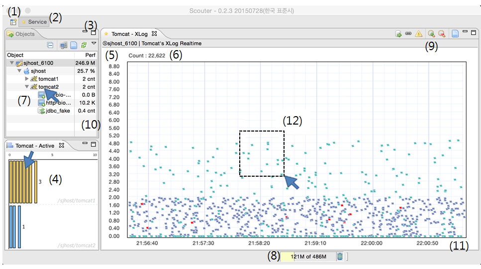

# How to use client
[[English](https://img.shields.io/badge/language-English-orange.svg)](How-To-Use-Client.md) 

* **(1)** Manage perspectives. Any existed perspectives can be added by clicking (+) button.
* **(2)** It is currently viewed perspectives. Perspective you customized like adding new chart can be save to new name, by clicking save button on floating menu. You can load previous perspective as well along to (1).
* **(3)** This is toolbar buttons on object explorer. You can mange objects currently loaded to show monitoring  metrics. Adding filter to objects, removing objects which is not used.
* **(4)** Active service equalizer. When you double-click the bar, you can see more detailed active service list.
* **(5)** Y-axis of response time on XLOG chart. The maximum(highest on Y-axis) value can be modified by clicking axis and input new specific value. Or after activating XLOG chart, use up/down arrow key.
* **(6)** The number of transactions displayed on XLOG chart.
* **(7)** Object navigation view. Top most object(sjhost_6100) is Scouter server. 
 * With a view of monitoring group, you can monitor each server's status and its services on tree view. 
 * You can see each monitoring metrics by clicking right mouse button on each object. 
 * 'sjhost' below Scouter server (sjhost_6100) means watching server host. And tomcat1 and 2 is JAVAEE object. The XLOG chart on example screen is Tomcat mode, and it is default view of it. 
 * You can filter the object type by **double-clicking** you want.
* **(8)** The HEAP memory usage on client program. You can check memory shortage. 
* **(9)** Toolbar for managing displayed data on XLOG chart. It is supported filtering diaglog, only error transactions, and so on.
* **(10)** It is the realtime monitoring value. For example, host type object is showing CPU usage, Tomcat type is displaying active service counter. 
* **(11)** X-axis on XLOG chart is used to show the end time of each transaction. To move time use left/right arrow key. To zoom in/out use + or - key.
* **(12)** To see more detailed transaction data, drag markers on XLOG chart. 
