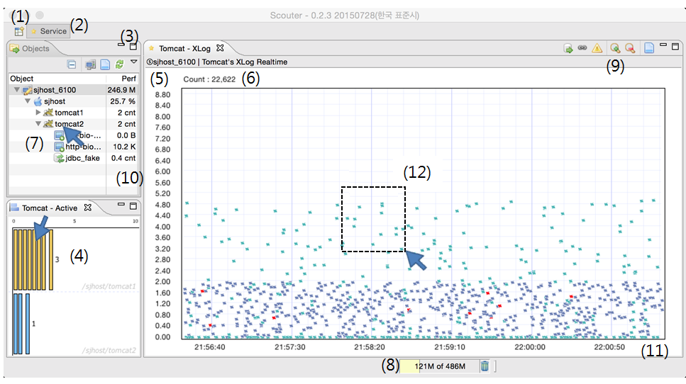

# How to use client
 

* **(1)** Perspective를 관리한다. 이미 만들어진 화면 구성이 있다면 (+)를 클릭하여 추가할 수 있다.
* **(2)** 현재 로드된 Perspective(화면구성)이다. 현재 Perspective 에 새로운 차트를 추가하고 재배치했다면 (2)에서 오른쪽 마우스를 눌러 다른 이름으로 저장할 수 있다. 원래 보던 Perspective 는 (1) 을 눌러서 다시 로드할 수있다.
* **(3)** 오픈젝트 익스플로러의 툴바 버튼들이다. 오브젝트를 필터링하거나 인액티브 상태의 오브젝트들을 화면에서 제거하는 메뉴들이 있다.
* **(4)** 액티브 서비스 이퀄라이져이다. 바를 더블 클릭하면 현재 액티브 서비스 리스트를 상세히 조회 할 수 있다.
* **(5)** XLog 차트의 응답시간 축이다. MAX 시간 값을 변경하려면 (5) 글자 부근을 클릭하여 값을 명시적으로 입력한다. 그리고 화면을 한 번 선택한 후 Up / Down 키을 이용하여도 된다.
* **(6)** 현재 XLog 차트에 나타나고 있는 트랜잭션 수이다.
* **(7)** 오브젝트 네비게이션 View 이다. 화면에서 최상의(sjhost_6100)오브젝트는 Scouter 서버이다. 
 * 모니터링 그룹 관점에서 그룹 내 하위 서버의 상태나 오브젝트들을 조회할 수 있는 메뉴들이 링크되어 있다.
 * 메뉴는 오른쪽 마우스를 통해 선택할 수 있다. 오른쪽 마우스를 클릭하면 시스템에 대한 성능들을 조회할 수 있다. 
 * Scouter 서버 아래의 sjhost는 서버 Host 를 의미한다. 그리고 tomcat1/tomcat2는 JAVA EE 타입의 오브젝트이다. JAVA 나 WAS 관련 성능 정보를 조회할 수 있으며 화면의 XLog 또한 Tomcat 타입이 디플트이다. 
 * 임의의 오브젝트를 **Double click**하면 선택한 오브젝트로 필터링 된다.
* **(8)** Scouter Client 의 힙메모리 사용량이다. 이것을 보고 클라이언트 프로그램의 메모리 부족을 판단할 수 있다. 
* **(9)** XLog 를 제어하기 위한 툴바, 에러 보기, 혹은 상세 필터링을 위한 화면을 열수 있다.
* **(10)** 오브젝트별 대표 성능지표를 조회 할 수 있다. 예를 들어 host 타입(sjhost)은 CPU 가, Tomcat 타입(tomcat1)은 Active Service Count 가 출력된다. 
* **(11)** XLog 의 X 축은 트랜잭션이 종료된 시간이다. 좌/우 방향키로 이동할 수 있고, +/- 키로 확대 축소가 가능하다.
* **(12)** XLog 에서 왼쪽 마우스를 드레그하여 영역을 선택할 수 있고, 영역에 속한 점들(트랜잭션)의 성능을 상세 분석할 수 있다. 
