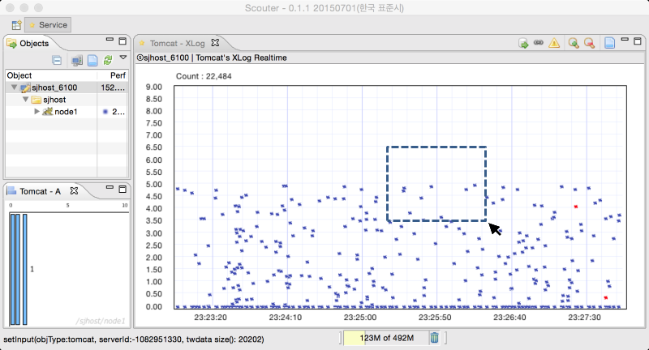
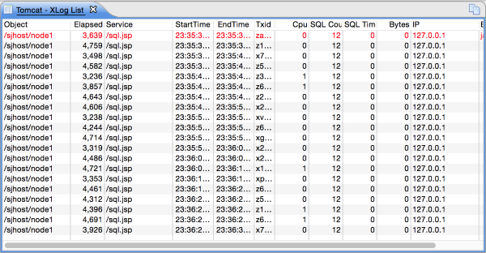
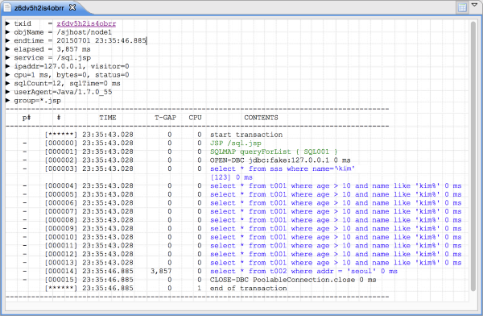

# How to read XLog chart
 

XLOG chart is for realtime transaction monitoring. Each marker represents individual transaction. X-axis is for the end time of transaction, and Y-axis is for the response time of it. The chart is reloaded every 2 seconds, pushing old things to left.

XLog chart is a kind of point chart, response-time-ditribution chart. XLog was developed in 2004. XLog is summarising current status of system with a perspective of response time. XLOG charting and analysis is very effective to tune application's performance, while sorting high response time.

As you can see the screenshot, it is able to crop mouse dragging area. You can see each marker's detailed transaction information on the dragged result list.
