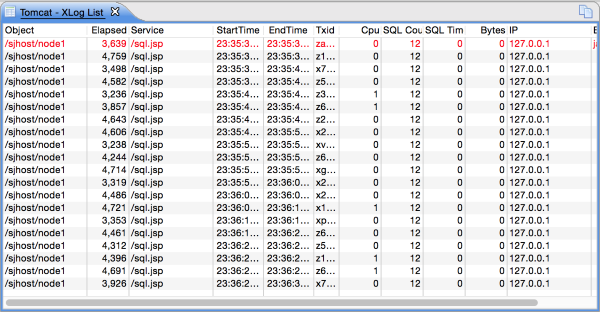

# XLog 보는 방법
 

Scouter 에서 응답시간 분포 그래프를 XLog 라고 부른다. XLog 는 Transaction Log 라는 의미에서 2004년에 처음 만들어졌다. 
XLog 는 전체 트랜잭션을 한눈에 파악할 수 있고 느린 트랜잭션을 선별하여 조회할 수 있기 때문에 응용 프로그램을 튜닝하는데 가장 효과적인 방법이라 할 수 있다.

XLog 차트는 하나의 트랜잭션(서비스 수행)을 하나의 점으로 표현하는 차트이다.
세로축은 트랜잭션이 수행된 응답시간, 가로축은 트랜잭션의 종료시간이다.
화면의 그래프는 일정시간(2초) 간격으로 Reload 된다. 이때 그래프는 좌측으로 쉬프트 된다.

위 화면에서처럼 왼쪽마우스 버튼을 이용하여 드레그하면 일부 점들을 선별하여 선택할 수 있다. 이렇게 선택된 트랜잭션들은 화면처럼 리스트로 나타난다. 리스트에서 하나를 선택하면 해당 트랜잭션에 대한 상세 정보를 볼 수 있다. 
