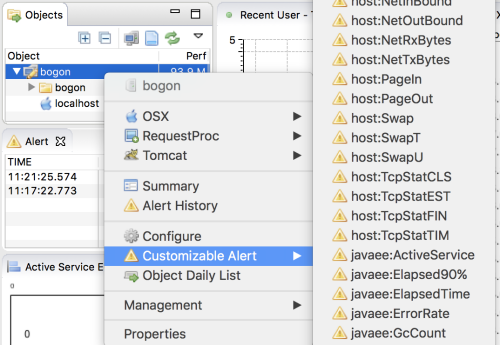
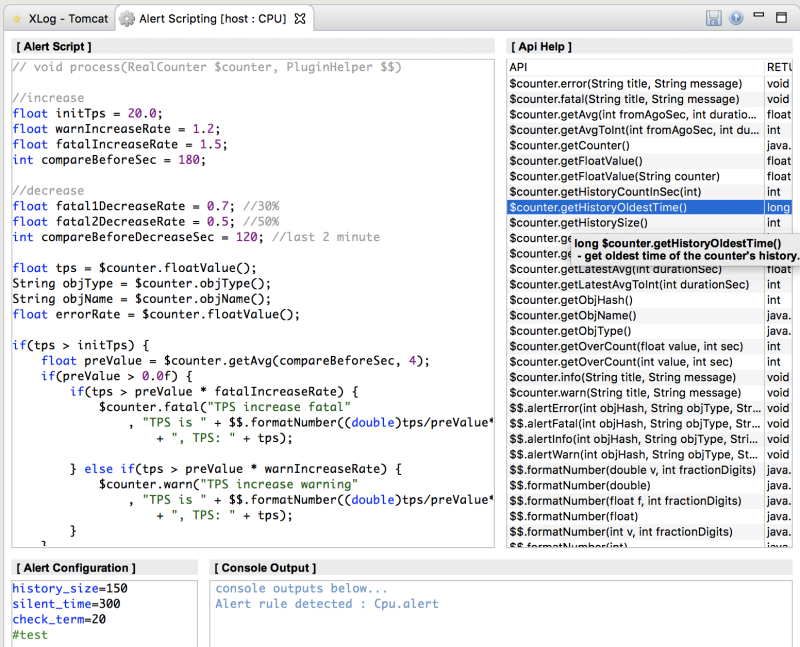

# Alert Plugin Guide
[](Alert-Plugin-Guide.md) [](Alert-Plugin-Guide_kr.md)

We can build our own alarm rules by handling alert scripting plugins which are able to compose various performance metrics.   

## How to
Alert script file is can be edited from scouter client ui or directly in scouter server.

### A. scripting in scouter client UI.
 1. open the alert scripting view in the context menu of a server in the object view.



 2. edit script & save it.




### B. scripting in scouter server.

 1. create 2 files in the server plugin directory (**[server_running_dir]/plugin** by default)
    * [PERFORMANCE_COUNTER_NAME].alert : script for alarm
    * [PERFORMANCE_COUNTER_NAME].conf : configuration for this alarm
 
 2. [PERFORMANCE_COUNTER_NAME].conf
   * ```properties
     history_size=150
     silent_time=300
     check_time=30
     ```
   * ```history_size``` : data count that will be kept
     * if it is set as 150ea, the oldest data may be 300 seconds before data because Scouter counter data is sent every 2 seconds.
   * ```silent_time``` : alarm sleep time - If the alarm is occurred in past [x] seconds, the same alarm is ignored.
   * ```check_time``` : script([PERFORMANCE_COUNTER_NAME].alert) invoking interval.

 3. [PERFORMANCE_COUNTER_NAME].alert
   * script file for alert rule (java)
   
   * sample1 (**GcTime.alert**)
     * alert when ```GcTime``` is over than 2 sec
      ```java
      // void process(RealCounter $counter, PluginHelper $$)
      int gcTime = $counter.intValue();
      if(gcTime > 2000) {
         $counter.fatal("gc time fatal", "gc time:" + respTime + "ms");
      }
      ```

   * sample1-1 (**GcTime.alert & latest counter's chart link**)
     * alert when ```GcTime``` is over than 2 sec
     ```java
     // void process(RealCounter $counter, PluginHelper $$)
     String objType = $counter.objType();
     String objName = $counter.objName();

     String widgetUrl = "http://127.0.0.1:6180/widget/simple/counter.html?source="

     String counterApi5Min = "TPS/ofType/" + objType;
     counterApi5Min += "?startTimeMillis=" + (System.currentTimeMillis()-300*1000);
     counterApi5Min += "?endTimeMillis=" + System.currentTimeMillis();

     String counterApiLatest5Min = "TPS/latest/300/ofType" + objType;

     int gcTime = $counter.intValue();
     if(gcTime > 2000) {
        String message = "gc time:" + respTime + "ms";

        message = "\n[Check TPS]\n";
        message += widgetUrl + java.net.UrlEncoder.encode(counterApi5Min) + "\n";

        message += "[Current 5 min TPS]\n";
        message += widgetUrl + java.net.UrlEncoder.encode(counterApiLatest5Min) + "\n";

        $counter.fatal("gc time fatal", message);
     }
     ```

   * sample2 (**Elasped90%.alert**)
     * alert when ```Elasped90%``` is over than 1.5 sec (ignore when TPS is lower than 3 sec.)
      ```java
      // void process(RealCounter $counter, PluginHelper $$)
      int warn = 1500;
      int fatal = 2000;
      
      int tps = $counter.intValue("TPS");
      int respTime = $counter.intValue();
      
      String objType = $counter.objType();
      String objName = $counter.objName();
      
      if(tps < 3) return;
      if(respTime > fatal) {
              $counter.fatal("resp time fatal high", "90% resp time:" + $$.formatNumber(respTime) + "ms, tps:" + tps);
      } else if(respTime > warn) {
              $counter.warn("resp time warn high", "90% resp time:" + $$.formatNumber(respTime) + "ms, tps:" + tps);
      }
      ```
      
   * sample3 (**TPS.alert**)
     * alert when ```TPS``` increase or decrease sharply. 
      ```java
      // void process(RealCounter $counter, PluginHelper $$)
      
      //increase 
      float initTps = 20.0;
      float warnIncreaseRate = 1.2;
      float fatalIncreaseRate = 1.5;
      int compareBeforeSec = 180;
      
      //decrease
      float fatal1DecreaseRate = 0.7; //30% 
      float fatal2DecreaseRate = 0.5; //50% 
      int compareBeforeDecreaseSec = 120; //last 2 minute
      
      float tps = $counter.floatValue();
      String objType = $counter.objType();
      String objName = $counter.objName();
      float errorRate = $counter.floatValue();

      if(tps > initTps) {
          float preValue = $counter.getAvg(compareBeforeSec, 4);
          if(preValue > 0.0f) {
              if(tps > preValue * fatalIncreaseRate) {
                  $counter.fatal("TPS increase fatal"
                      , "TPS is " + $$.formatNumber((double)tps/preValue*100) + "% higher than " + compareBeforeSec + "sec ago"
                          + ", TPS: " + tps);
      
              } else if(tps > preValue * warnIncreaseRate) {
                  $counter.warn("TPS increase warning"
                      , "TPS is " + $$.formatNumber((double)tps/preValue*100) + "% higher than " + compareBeforeSec + "sec ago"
                          + ", TPS: " + tps);
              }
          }
      }
      
      float preValue = $counter.getAvg(compareBeforeDecreaseSec, 4);
      if(preValue > 5.0f) {
          if(tps < preValue * fatal2DecreaseRate) {
              $counter.fatal("TPS decrease fatal"
                      , "TPS is " + $$.formatNumber(((double)1-tps/preValue)*100) + "% lower than " + compareBeforeDecreaseSec + "sec ago"
                          + ", TPS: " + tps);
          } else if(tps < preValue * fatal1DecreaseRate) {
              $counter.error("TPS decrease warn"
                      , "TPS is " + $$.formatNumber((double)(1-tps/preValue)*100) + "% lower than " + compareBeforeDecreaseSec + "sec ago"
                          + ", TPS: " + tps);
          }
      }
      ```      
      
## RealCounter API
| method | desc |
| ------------ | ---------- |
| objName()                                  | get object's name that produced the counter value   | 
| objType()                                  | get object's type that produced the counter value   |
| intValue()                                 | get counter value as integer   |
| floatValue()                               | get counter value as float   |
| historySize()                              | get history size set by the conf file   |
| overCount(int value, int sec)              | get how many times exceed the value in the seconds   |
| overCount(float value, int sec)            | get how many times exceed the value in the seconds   |
| getAvg(int fromAgoSec, int durationSec)    | calculate average of the counter values in fromAgoSec for durationSec   |
| getLatestAvg(int durationSec)              | calculate average of the counter values from durationSec ago to now   |
| info(String title, String message)         | invoke alarm as info level   |
| warn(String title, String message)         | invoke alarm as warn level   |
| error(String title, String message)        | invoke alarm as error level   |
| fatal(String title, String message)        | invoke alarm as fatal level   |
| floatValue(String anotherCounterName)      | get another counter's current value by the name   |
| intValue(String anotherCounterName)        | get another counter's current value by the name   |

## Counter names
 * [counters.xml](https://github.com/scouter-contrib/scouter/blob/fe74bdb73a34be2f390f8476991d59a5de6ea204/scouter.common/src/main/resources/scouter/lang/counters/counters.xml)

## $$ (PluginHelper) API
 - Refer to **[PluginHelper API](./PluginHelper-API_kr.md)**
