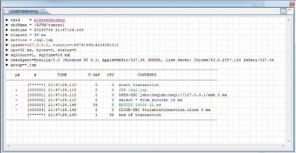

#Editing Getting Start Profile SQL
 

> We will discuss the way of monitoring SQL with installing the HSQL DB and executing some sample applications. It is premised that you done with the [Getting Started](./Getting-Started.md).

## Installing HSQL
### Downloading files
[http://hsqldb.org/](http://hsqldb.org/)

### After unzip, run HSQL DB as a server mode
C:\hsqldb\bin\runServer.bat --database.0 file:mydb --dbname.0 xdb

### Installing the HSQL jdbc driver on tomcat and Setting up the datasource

[http://hsqldb.org/doc/guide/](http://hsqldb.org/doc/guide/)
Copy the ${HSQL_HOME}/lib/hsql.jar to ${TOMCAT_HOME}/lib/
Setting up the datasource on ${TOMCAT_HOME}/conf/web.xml

<Resource name="jdbc/hsql" auth="Container" type="javax.sql.DataSource"
    maxActive="100" maxIdle="100" maxWait="10000"
    username="SA" password=""    
    driverClassName="org.hsqldb.jdbc.JDBCDriver"
    url="jdbc:hsqldb:hsql://127.0.0.1/xdb"/>

## Execute
1. [create.jsp](https://github.com/scouter-project/scouter-help/blob/master/misc/test-jsp/create.jsp)
2. [sql.jsp](https://github.com/scouter-project/scouter-help/blob/master/misc/test-jsp/sql.jsp)
3. [lock.jsp](https://github.com/scouter-project/scouter-help/blob/master/misc/test-jsp/lock.jsp)

After executing the sql.jsp, you can see the result on Scouter like:

