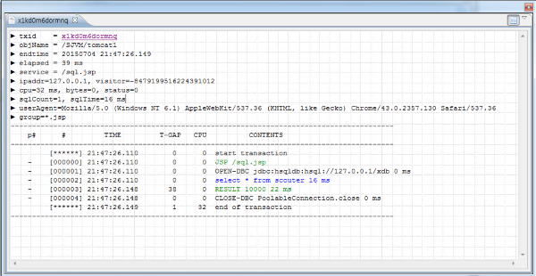

#Editing Getting Start Profile SQL
[](Getting-Start-Profile-SQL.md) [](Getting-Start-Profile-SQL_kr.md)

> 본문서에서는 HSQL DB를 설치하고 간단한 샘플 애플리케이션을 실행하여
> SQL이 어떤식으로 모니터링 되는지 설명한다.
> 본문서는 이미 [Getting Started](./Getting-Stzarted_kr.md)를 이해한다는 전제로 설명한다.

## HSQL설치하기

### Download 파일  
  http://hsqldb.org/

### 압축을 풀고 서버 모드로 실행
  C:\hsqldb\bin\runServer.bat --database.0 file:mydb --dbname.0 xdb

### 톰켓에 hsql jdbc 드라이버 설치 및 데이터소스 설정
  http://hsqldb.org/doc/guide/

  ${HSQL_HOME}/lib/hsql.jar 를 ${TOMCAT_HOME}/lib/.로 복사 

  ${TOMCAT_HOME}/conf/web.xml 에 데이타소스 설정
```
<Resource name="jdbc/hsql" auth="Container" type="javax.sql.DataSource"
    maxActive="100" maxIdle="100" maxWait="10000"
    username="SA" password=""    
    driverClassName="org.hsqldb.jdbc.JDBCDriver"
    url="jdbc:hsqldb:hsql://127.0.0.1/xdb"/>
```

### execute
1. [create.jsp](https://github.com/scouter-project/scouter-help/blob/master/misc/test-jsp/create.jsp)
2. [sql.jsp](https://github.com/scouter-project/scouter-help/blob/master/misc/test-jsp/sql.jsp)
2. [lock.jsp](https://github.com/scouter-project/scouter-help/blob/master/misc/test-jsp/lock.jsp)

sql.jsp를 실행하면 Scouter에서 아래와 같은 데이터를 조회할 수 있다.

 