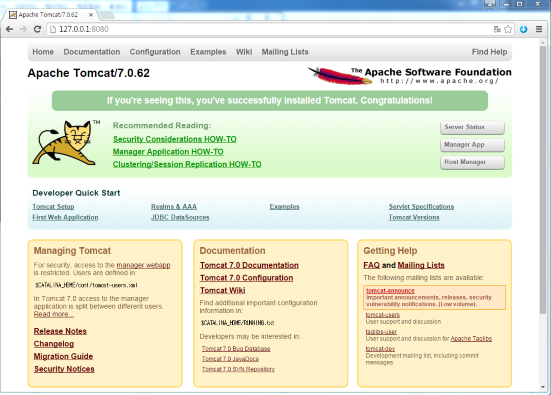
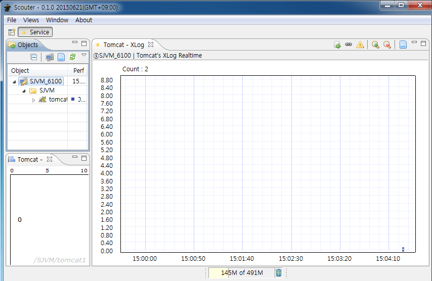

# Getting Started
[](Getting-Started.md) [](Getting-Started_kr.md)

Scouter는 Tocmat, MariaDB, Linux등의 OSS에 대한 성능을 모니터링하는 툴이다.
먼저 Scouter를 처음 사용하는 사람들을 위해 간단한 설치와 기본적인 사용법에대해서 설명한다.

## 1. 모니터링 할 샘플 웹 시스템 설치하기
모니터링 할 Tomcat이 이미 있다면 2.SCOUTER 설치하기를 바로 진행하면 된다.
여기서는 먼저 Scouter가 모니터링 하기 위해 기본적인 환경을 만든다.
JDK와 톰켓을 설치한다.
OS환경은 윈도우32를 가정하다 다른 OS라면 일반적인 패스와 기동쉘등을 고려하여 수정해주면 된다. 만약 톰켓 설치에 익숙하다면 이번 내용을 스킵해도 된다.

### Install JDK
oracle.com으로 가서 JDK7을 다운받아 설치한다.
```
jdk-7u79-windows-i586.exe
jdk-7u79-linux-x64.tar.gz(Linux 64)
Ref)http://www.oracle.com/technetwork/java/javase/downloads/jdk7-downloads-1880260.html
```
나머지는 일반적인 JDK설치가이드에 따른다.

주의)설치 디렉토리는 상관없지만 JRE버전이 아니라 JDK버전을 설치해야한다.

### Tomcat 설치
JDK7과 호환되는 Tomcat을 설치한다. 서비스 등록이 아니면 동일 버전을 Linux나 윈도우에 설치가능함으로 Tomcat7버전을 받아서 설치한다.
```
apache-tomcat-7.0.62.zip
http://tomcat.apache.org/download-70.cgi
```
톰켓 설치는 단순히 정해진 디렉토리에 압축을 풀어놓음으로써 완료될 수 있다.

C:\Tomcat7 에 Tomcat이 설치되어있다고 가정한다. 만약 다른 디렉토리에 설치했다면 그에 맞춰주기 바란다.


### 실행하기
톰켓을 실행하여 브라우저로 접속해 본다. 자세한 사항은 Apache문서를 참조한다.

http://tomcat.apache.org/tomcat-7.0-doc/index.html

${TOMCAT_HOME}/bin에 가면 startup.bat/startup.sh가 있다. 이 쉘을 실행하면 톰켓이 기동된다.

JAVA_HOME이 정상적으로 설정되지 않으며 다음과 같은 에러가 발생한다.
```
c:\Tomcat7\bin>startup.bat
Neither the JAVA_HOME nor the JRE_HOME environment variable is defined
At least one of these environment variable is needed to run this program
```
c:\Tomcat7\bin>set JAVA_HOME=c:\java7

정상적으로 설치되고 c:\Tomca7\bin\startup.bat를 실행하면

```
6월 22, 2015 2:11:27 오후 org.apache.catalina.startup.HostConfig deployDirectory

정보: Deployment of web application directory C:\Tomcat7\webapps\ROOT has finish
ed in 94 ms
6월 22, 2015 2:11:27 오후 org.apache.coyote.AbstractProtocol start
정보: Starting ProtocolHandler ["http-bio-8080"]
6월 22, 2015 2:11:27 오후 org.apache.coyote.AbstractProtocol start
정보: Starting ProtocolHandler ["ajp-bio-8009"]
6월 22, 2015 2:11:27 오후 org.apache.catalina.startup.Catalina start
정보: Server startup in 1251 ms
```
위와 같은 메세지를 볼 수 있다.

브라우저를 이용해서 http://127.0.0.1:8080 에 접속해서 화면이 출력되면 톰켓 설치가 완료 된 것이다.



## Scouter 설치하기
톰켓 모니터링을 위해 스카우터는 3가지 컴포넌트를 설치해야한다. 본 예제에서는 모든 컴포넌트를 한 서버에 설치한다


### Agent 설치 및 실행
에이전트 컴포넌트를 다운 받는다.

https://github.com/scouter-project/scouter/releases/download/v0.4.0/scouter.agent.tar.gz

c:\에 압축을 풀면 c:\scouter\agent\scouter.agent.jar파일이 만들어진다.
기동 쉘을 만든다. C:\Tomcat7\bin\scouter.bat
파일 내용은 아래와 같다.

```
set JAVA_HOME=c:\java7
set JAVA_OPTS=-javaagent:c:\scouter\agent.java\scouter.agent.jar
startup.bat
```
Tomcat을 다시 실행하면 시작 창에서 아래와 같은 메세지를 볼 수 있다.
```
  ____                  _
 / ___|  ___ ___  _   _| |_ ___ _ __
 \___ \ / __/   \| | | | __/ _ \ '__|
  ___) | (_| (+) | |_| | ||  __/ |
 |____/ \___\___/ \__,_|\__\___|_|
 Scouter version 0.4.0 20151213
 Open Source S/W Performance Monitoring

20150622 14:31:53 [SCOUTER] loaded by system classloader
20150622 14:31:57 [SCOUTER] jar:file:/C:/scouter/agent.java/scouter.agent.jar
20150622 14:31:57 [SCOUTER] Version 0.4.0 20151213
```
If you see the above message, the installation of Agent will succeed


## Collector Server 설치 및 실행
데이터를 받아서 저장할 서버를 설치한다. 먼저 github에서 서버를 다운로드 받는다.

https://github.com/scouter-project/scouter/releases/download/v0.4.0/scouter.server.tar.gz

agent와 마찮가지로 c:\에서 압축을 풀면 c:\scouter\server*.* 디렉토리와 파일이 만들어진다.

RUN "C:\scouter\server\startup.bat"

```
C:\scouter\server>java -Xmx512m -classpath ./boot.jar scouter.boot.Boot ./lib
  ____                  _
 / ___|  ___ ___  _   _| |_ ___ _ __
 \___ \ / __/   \| | | | __/ _ \ '__|
  ___) | (_| (+) | |_| | ||  __/ |
 |____/ \___\___/ \__,_|\__\___|_|
 Scouter version 0.4.0 20151213
 Open Source S/W Performance Monitoring

System JRE version : 1.7.0_67

```

위와 같은 실행모습을 볼 수 있다.

## Client 설치 및 실행
클라이언트는 Eclipse RCP로 개발되어있다. 따라서 각 OS에 맞는 버전을 다운받아 설치하면된다.
여기서는 Windows 32bit 용 파일을 다운받는다.
https://github.com/scouter-project/scouter/releases/download/v0.4.0/scouter.client.product-win32.win32.x86.zip
파일을 c:\scouter.에 복사한 후에 압축을 풀고 c:\scouter\scouter\scouter.exe 을 실행한다.
실행시 로그인 창이 나타난다. 입력 창에 다음과 같이 입력한다.

```
Server Address : 127.0.0.1:6100
ID : admin
Password : admin
```



## 마무리
이제 브라우저를 통해 톰켓에 어떤 서비스를 요청하면 화면에 그 결과가 Dot로 출력 되는 것을 볼 수 있다.
각 Dot는 하나의 서비스 호출(트랜잭션)의 수행정보를 담고 있으며 상세한 정보를 보기 위해서는 왼쪽 마우스로 화면을 드레그하면 사각박스가 나타나는데 그 박스를 이용해서 분석하고자하는 Dot들을 선택한다.