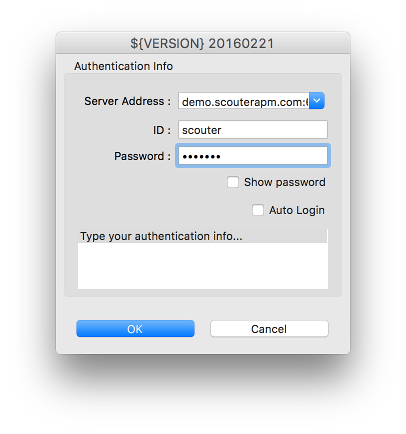

# Live Demo
 

Scouter 를 바로 사용해 볼 수 있도록 Live 데모 시스템이 구성되어 있으며
클라이언트만 다운로드 하여 접속해 볼 수 있다.

현재 Live 데모 시스템은 v1.8.0 으로 구성되어 있으므로 v1.8.0 버전 클라이언트로 접속하여 볼 수 있다

1. [Client(Viewer) 다운로드](https://github.com/scouter-project/scouter/releases/tag/v1.8.0)
2. Client 실행하고 아래 정보를 입력하여 Scouter 데모 서버로 접속한다.
  - Server 주소 : demo.scouterapm.com:6100
  - ID : admin
  - Password : admin
  

## scouter WEB API swagger
 - [http://demo.scouterapm.com:6180/swagger/index.html](http://demo.scouterapm.com:6180/swagger/index.html)
