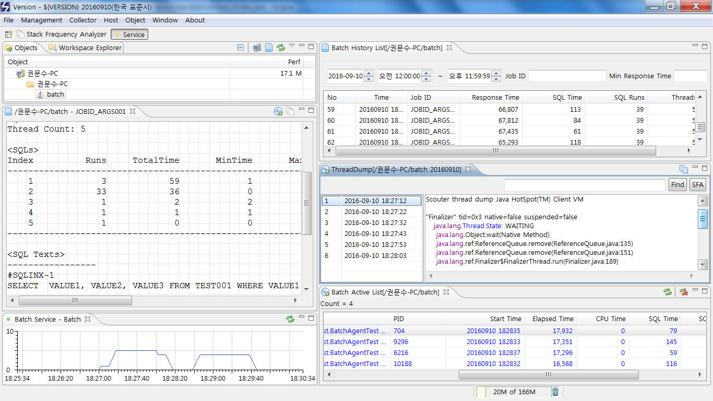

# Stand-alone Java Batch Agent

스카우터 APM는 WAS 뿐만 아니라 배치 모니터링 기능도 제공한다.
배치는 대량 건을 처리하므로 일반 APM으로는 프로파일링 로그가 너무 많이 생겼서 모니터링할 수 없거나 가능하더라도 성능이 저하된다. 스카우터는 배치 특성을 고려하여 통계 중심으로 성능 데이터를 수집하고 분석하면서도 큰 성능저하 없이 자바 함수 레벨까지 분석할 수는 강력한 기능을 제공한다.

스카우터 배치 에이전트는 아래와 같은 기능을 제공한다.
- 수행시간 측정(CPU 사용량)
- SQL 프로파일링(SQL문, SQL 수행시간, SQL 처리건수, SQL 수행횟수)
- 주기적인 프로세스 스택 수집  

## 인스톨 순서
스카우터 서버와 클라이언트가 설치되어 있다면 아래 두단계를 거치면 자바 배치 모니터링이 가능하다.
####1. 자바 배치 에이전트 다운로드 및 설치(scouter.agent.tar.gz - scouter/agent.batch 디렉토리)
####2. 자바 배치 프로세스에 스카우터 옵션 추가(참고: 자바옵션)
####3. 스카우터 Batch 데몬 실행(참고: 자바 에이젠트와 자바 배치 에이전트의 차이점)

## 자바 옵션
스카우터 배치 에이전트의 기본 설치 방법은 WAS 기반 자바 에이전트와 동일하다.
자바 배치 실행 명령(배치 기동 쉘 스크립트)에 -javaagent와 -Dscouter.config 설정을 추가하면 모니터링이 가능하다.

```
JAVA_OPTS=" ${JAVA_OPTS} -javaagent:${SCOUTER_AGENT_DIR}/agent.batch/scouter.agent.batch.jar"
JAVA_OPTS=" ${JAVA_OPTS} -Dscouter.config=${SCOUTER_AGENT_DIR}/agent.batch/conf/scouter.batch.conf"
```
## 자바 에이젠트와 자바 배치 에이전트의 차이점
스카우터 자바 배치 에이전트가 스카우트 자바 에이전트와 다른 점은 배치 에이전트가 설치된 서버에 별도 스카스터 배치 데몬을 실행시켜야 한다는 것이다.
배치 프로세스는 항상 실행중이지 않고, 수십개 이상 프로세스가 동시에 실행하기 때문에 항상 데몬 형태로 배치 서버에 상주하면서 배치 에이전트 환경설정이나 통합 정보 수집 및 전송을 담당할 프로세스가 필요하다.
스카우터 배치 데몬은 scouter.agent.batch.jar 내 포함되어 있다. 실행은 agent.batch 디렉토리에 있는 startup.sh를 실행하면 된다.

*startup.sh*
```
nohup java -cp ./scouter.agent.batch.jar -Dscouter.config=./conf/scouter.batch.conf scouter.agent.batch.Main &
```
***
스카우터 배치 데몬이 실행되지 않으면 배치 클라이언트에서 환경설정 수정, 스택 수집, 배치 성능 카운트 수집 등 기능이 정상 동작하지 않는다.

## 환경설정

### 환경설정 파일 
`${SCOUTER_AGENT_DIR}/scouter.batch.conf` 같이 환경설정 파일을 지정하고, 내용을 수정함으로써 모니터링 적용 옵션을 변경할 수 있다.
> 옵션이 없으면 기본 값이 적용된다.

### 예
*${scouter_agent_directory}/batch.agent/conf/scouter.batch.conf*
```
# Stand-Alone mode
scouter_standalone=false

# Batch ID (batch_id_type: class,args,props) (batch_id: args->index number, props->key string)
batch_id_type=args
batch_id=0

# Scouter Server IP Address (Default : 127.0.0.1)
net_collector_ip=127.0.0.1

# Scouter Server Port (Default : 6100)
net_collector_udp_port=6100
net_collector_tcp_port=6100

# Scouter Name(Default : batch)
obj_name=batch
```
***

###  환경설정 항목
항목     |    기본 값    | 설명
------------ | -------------- | --------------
scouter_enabled | true | 스카우터 자바 배치 에이언트의 모니터링 여부를 설정함(true - 모니터링 가동)
scouter_standalone | false | 스카우터 서버에 모니터링 결과를 전송할 지 여부를 설정함(false - 스카우터 서버에 모니터링 결과 전송) true로 지정하면 log_dir에 모니터링 결과를 배치 종합 모니터링(sbr파일-텍스트 형식)과 스택 로그(log파일)를 남긴다. false는 종합 모니터링 결과는 파일 남기지 않고 스택 로그 파일은 서버 전송 후 삭제 한다.
batch_id_type | class | 배치 JOB ID를 추출하는 규칙 지정(class - 배치 프로세스의 시작 자바 클래스를 JOB ID로 지정, args - 실행 클래스 뒤에 추가 설정된 파라미터중 한 개를 JOB ID로 지정, props - JVM 설정 파라미터중 한 개를 JOB ID로 설정) 
batch_id |       | batch_id_type 설정에 따른 JOB ID 추출을 위한 세부 설정으로 batch_id_type에 따라 의미가 다름(args - 실행 명령에 추가된 파라미터에서 JOB ID의 색인 위치(0부터 시작), props - JVM 설정 파라미터의 이름(예: -DjobID=TEST001 이면 설정 값은 jobID)) 
sql_enabled | true | SQL 수행 통계를 수집할지 여부를 실정함(true - SQL 통계 수집)
sql_max_count | 100 | SQL 수행 통계 수집 시 모니터링할 수집할 수 있는 최대 SQL 수. 실행된 SQL문이 기본 값인 100가지 종류를 넘으면 나머지 SQL문들은 전체가 하나의 SQL문 통계로 잡히고 SQL문은 "Others"로 기록됨
hook_jdbc_pstmt_classes |  | SQL 수행 통계 수집을 위해 기본 설정된 JDBC PreparedStatement 클래스 이외 다른 PreparedStatement 클래스를 사용할 때 해당 클래스 명을 추가함(구분 기호는 쉼표(,))
hook_jdbc_stmt_classes |  | SQL 수행 통계 수집을 위해 기본 설정된 JDBC Statement 클래스 이외 다른 Statement 클래스를 사용할 때 해당 클래스 명을 추가함(구분 기호는 쉼표(,))
hook_jdbc_rs_classes |  | SQL 수행 통계 수집을 위해 기본 설정된 JDBC ResultSet 클래스 이외 다른 ResultSet 클래스를 사용할 때 해당 클래스 명을 추가함(구분 기호는 쉼표(,))
sfa_dump_enabled | true | 자바 배치 수행 시에 주기적으로 스택을 수집하여 함수 레벨까지 성능을 분석할 수 있도록 하는 기능(true - 스택 수집). 스택 분석 시에는 Stack Frequency Analyzer를 사용함
sfa_dump_interval_ms | 10000 | 자바 배치 스택 수집 주기 설정(밀리초)
sfa_dump_filter |  | 스택 상에 지정된 특정 문자열이 들어가 있는 경우에만 수집하도록 필터를 설정함(필터간 구분자는 쉼표(,) 사용). 수집되는 스택의 양을 줄여 전체 로그 파일 크기를 줄일 때 사용함
sfa_dump_dir | 에이전트 디렉토리 밑 dump | 스택 로그 파일이 쌓일 디렉토리를 지정함(기본: 자바 배치 에이전트가 설치된 홈 디렉토리 아래 dump 디렉토리에 쌓임). 스카우터 서버로 전송이 이루어지면 해당 스택 로그 파일은 삭제됨
sfa_dump_header_exists | true | 스택 수집시에 수집 시간과 JVM 정보등 헤더 정보를 남길 지 여부를 설정함(true - 헤드 정보 남김)
sfa_dump_send_elapsed_ms | 30000 | 자바 배치 수행 시간이 설정된 시간 이상인 경우에만 스카우터 서버로 수집된 스택 로그를 전송함(밀리초)
batch_log_send_elapsed_ms | 30000 | 자바 배치 수행 시간이 설정된 시간 이상인 경우에만 스카우터 서버로 배치 수행 정보를 전송함(밀리초)
thread_check_interval_ms | 1000 | 자바 배치 내부에 스레드가 종료되었는지 주기적으로 체크하는 시간(기본: 1초). 자바 배치 에이전트는 스레드 단위로 SQL 수행 통계를 수집하는데 스레드가 종료되면 해당 스레드의 수행 통계를 전체 통계에 통합하는 작업을 수행함. 이를 위해 스레드 종료 여부를 확인함
net_collector_ip | 127.0.0.1 | 스카우터 서버의 IP 주소
net_collector_udp_port | 6100 | 스카우터 서버의 UDP 수집 Port 번호
net_collector_tcp_port | 6100 | 스카우터 서버의 TCP 통신 Port 번호
net_collector_tcp_session_count | 1 | 스카우터 서버와 연결할 TCP 연결 수
net_collector_tcp_so_timeout_ms | 60000 | 스카우터 서버와 TCP 연결 소켓 읽기 타임아웃 시간(밀리초)
net_collector_tcp_connection_timeout_ms | 3000 | 스카우터 서버와 TCP 연결 타임아웃 시간(밀리초)
net_local_udp_port | 6101 | 스카우터 자바 배치 에이전트의 UDP 통신 Port. 각 배치 프로세스가 배치 에이전터에 상태 데이터를 전송할 때 사용하는 UDP 포트
net_udp_packet_max_bytes | 60000 | UDP 통신 시 최대 패킷 크기
obj_name | | 자바 배치 에이전터의 명칭(기본 명을 변경하고자 할 때 사용함)
obj_host_type | | 자바 배치가 수행하는 서버의 타입 지정
obj_host_name | | 자바 배치가 수행하는 서버의 호스트 명을 지정(스카우터 호스트 에이전트에서 Obj_name을 변경한 경우 해당 서버 내부에 있는 각 에이전트의 소속 호스트 명도 수정해야 함) 
_log_asm_enabled | false | 스카우터가 모니터링을 위한 바이트코드 엔지니어링을 정상적으로 수행하는지 여부를 확인하기 위한 디버그 설정(false - 디버그 해제)
log_dir | | 자바 배치 에이전트의 실행 로그를 저장하는 디렉토리(기본은 자바 배치 에이전트 설치 디렉토리 아래 log 디렉토리) 
log_rotation_enabled | true |  로그 파일을 일 단위로 생성할지 여부를 설정함(true - 일 단위 로그 생성)
log_keep_days | 7 | 자바 배치 에이전트 로그를 보관하는 기간 설정(일). 보관기간이 지나면 삭제됨.

## 스카우터 배치 모니터링 화면 예

