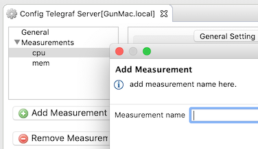
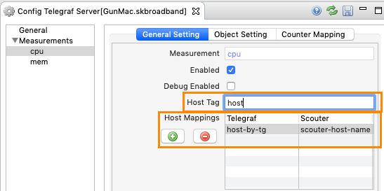
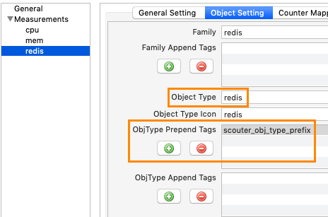
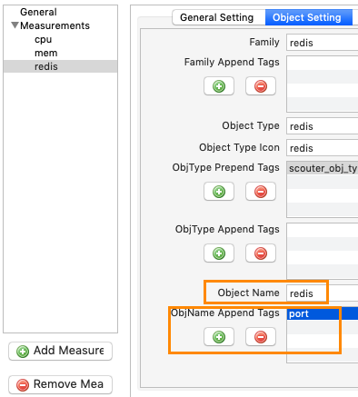
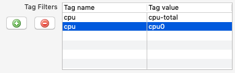

# Telegraf Server Feature
[](Telegraf-Server.md) [](Telegraf-Server_kr.md)

The Scouter-telegraf Server function allows you to integrate data from Telegraf into the Scouter.  
The Scouter collector is now interoperable with the HTTP output of Telegraf and will be provided with dedicated telegraf-scouter output later.  
  - [Telegraf HTTP Output plugin](https://github.com/influxdata/telegraf/tree/master/plugins/outputs/http)

You can monitor the performance information of various products through Telegraf's Input Plugin. Refer to the telegraf plugin page for current inputs.
  - [Telegraf Input plugins](https://github.com/influxdata/telegraf/tree/master/plugins/inputs)


## Apply Telegraf server function

### 1. Enabling the telegraf Server option on the Scouter
First, enable the http server option of the Collector server on the Scouter Client screen.
  - Menu : **Collector > Configures > Configure**
    - `net_http_server_enabled=true`

If you want to change the http port, set it to `net_http_port=xxx`. The default value is 6180.  
If you change any of the above options, you must restart the Collector.  

Next, activate the Telegraf setting.
  - Menu : **Collector > Configures > Telegraf > Telegraf Configure**
    - In the General tree, check `Enabled` to enable the Telegraf Server function.

If you need to check the requested data, check `Debug Enabled 'to log all the requested data.

### 2. Configure data transfer to the scouter via the Http output of Telegraf
Set the end point of the Telegraf http output to the scouter server set above.
```javascript
  [[outputs.http]]
    url = "http://my-scouter-server:6180/telegraf/metric"
    timeout = "5s"
    method = "POST"
    data_format = "influx"
```

The scouter processes the request every 2 seconds and mainly uses the real time chart, so the request interval of the telegraf is also adjusted between 2 seconds and 10 seconds.  
```javascript
[agent]
  ...
  interval = "4s"
  ...
  flush_interval = "4s"
```

### 3. Set counter mapping to Scouter Collector
You must map the field of measurement that is passed in telegraf to the scouter counter.  
There are a few things you need to do.
 - measurement registration
 - Host mapping setting(optional)
 - object type setting
 - object name setting
 - Map each field of the line protocol to the counter of the scouter
    
The configuration can be done through the telegraf configure screen of the scouter client and refer to the following.  
(Or you can modify the scouter-telegraf.xml file directly.)

#### 3.1. Measurement registration
If this is your first time using the Scouter-telegraf's feature, it's a good idea to enable the debug option and watch the incoming log.  
Register the measurement you want to monitor from the line protocol displayed on the log.


#### 3.1. Host Mapping setting
Usually, performance information is transmitted from several devices, so it is necessary to identify the host information.  
In general, it is not necessary to change this setting, but in some cases, a certain line protocol may not have a host tag.  
  
The host name information is transmitted to the `host` tag of the line protocol. If the tag containing the host information is not`host`, it can be changed.
If the transmitted host name is different from the host name set in the scouter, you can also configure the mapping.
(Usually the same.)


#### 3.2. Family setting
A family is a name that refers to a collection that has the same performance monitoring items.  
For example, the Host Family has performance information such as cpu, memory, and disk io.  
  
In the example below, set Family to redis.  
In this configuration, Family is registered as `X$redis` internally to prevent duplication of names with the built-in families of scouter.

#### 3.3. Object type setting
An object type is a set of objects that are monitored at one time by the scouter.  
Since it is usually monitored on a system-by-system basis, **the same families in a particular system** can be considered as one object type.  
  
For example, multiple redis instances of the ordering system may be targets that need to be monitored at one time.
This is called **object type** in scouter.
So if you specify the object type of these redis instances, you can set it like `ORDER_SYSTEM_redis`.
Here, prefixes such as ORDER_SYSTEM which precedes them are added to the telegraf tag, and the scouter combines them to determine the object type.
For the setting example, refer to the following figure.



  
There are many ways to add tags to telegraf. The easiest way is to set them with global tags.  
Or you can add tags for each input, and you can set it up in various ways.  
(For more information, see the telegraf manual.)
```javascript
[global_tags]
  scouter_obj_type_prefix = "ORDER_SYSTEM"
```

The value `scouter_obj_type_prefix` set in the above example is the default value of objtype_prepend_tag.  
If there is no value in the `scouter_obj_type_prefix` tag, the object type of all performance metrics imported into redis measurement is just **X$redis**.  
(`X$` is added automatically by the scouter to prevent overlap with the built-in object type.)  
Therefore, you can ignore this setting if you want to manage all redis in one type without system distinction.

#### 3.4. Object name setting
Scouter calls an individual object to be monitored. Here we set the name of this object (`object_name`).  
The full name of object_name is internally registered as `/{host-name}/object-name`, so object name may be duplicated if host name is different.  


In the above figure, objName_append_tag is set to `port`, which is a case where there are multiple redis in one host.  
(If you do this, the object name will be `redis_30779`,` redis_30789`, and so on.)

The input values through telegraf are as follows

>redis,**host**=sc-api-demo-s01.localdomain,**port**=30779,**scouter_obj_type_prefix**=ORDER_SYSTEM,**server**=172-0-0-0.internal  keyspace_hits=5507814i,expired_keys=1694047i,total_commands_processed=17575212i 1535289664000000000

The first `redis` is **measurement**, followed by `host`, `port`, `obj_type_prefix`, and `server` are **tag**.  
The following numeric information is called **field** in the line protocol. There are `keyspace_hits`, `expired_keys`, and `total_commands_processed` fields.  
  
The object name defined by the above setting will eventually become **redis_30779**.  
If you set objname_append_tag to `server` and `port`, the object name will be **redis_172-0-0-0.internal_30779**.  
  
The result of setting up to now can be summarized as follows.  
```javascript
family = X$redis
object_type = X$ORDER_SYSTEM_redis
object_name = redis_30779
```

#### 3.5. Counter mapping setting
Finally, set the field of the line protocol to the counter of the scouter. The counter is the performance information that the family can have.  
(In this example, it is defined by mapping the performance information that a family named X$redis can have.)  
  
Fields that are not set here are discarded without being stored. Naturally, fields that are not to be monitored should be handled by the telegraf client so that they are not transmitted to the scouter.  
Each mapping setting item is as follows.  
   - Tg-field, **required**
     - The field name passed in the line protocol.
   - Counter, **required**
     - It is the counter name in the scouter.
     - **A counter name must not be duplicated within scouter**
   - Delta Type, **required**
     - The delta counter is a counter showing the amount of change per second.
     - If delta counter is specified, _$delta is added to name and /s is added to unit.
     - If you specify `Both`, you will have both a normal counter and a delta counter.
   - counter desc - optional, default : counter name
     - This value is used when the scouter displays the counter on the screen.
   - unit - optional
     - It is the unit of the value.
   - totalizable - optional, default : true
     - Whether this value can be summarized.
     - For example, throughput is true and memory utilization percent is false (it is strange to sum the memory usage percent of several VMs)
     - If this value is true, you can open the total chart on the screen of the scouter.
   - nomalizing seconds
     - This is the size of the time window to obtain the mean value of the counter.
     - default 0s for normal counter, default 30s for delta counter.

The screen below is an example of the telegraf setting screen.


#### 3.6. Counter mapping - tag filter
It can only be collected if the tag has a certain tag value.  
For example, when collecting cpu information of a VM with four cpu, the usage amount of each cpu and the usage amount of the entire cpu are all collected and can be classified by a specific tag value.  
If you want to collect only if the value of `cpu` tag is cpu-total, cpu-0, set it as follows.  



If you want to collect only the value of the `cpu` tag except cpu-total, set it to `!cpu-toal`.

```properties
input_telegraf_$cpu$_tag_filter=cpu:!cpu-total
```
#### 3.7. scouter-telegaf.xml
All of the above settings can be modified directly in the xml configuration file using the Scouter client.
 - Menu : **Collector > Configures > Telegraf Config > Edit scouter-telegraf config file directly**

> When you install the Scouter collector, there is a sample file in scouter-telegraf.xml in the ./conf directory.
> This sample file contains examples for the redis, nginx, and mysql metrics.

### 4. check counters.site.xml 

Once the above configuration is done, if telegraf performance information is requested by the scouter collector, meta information about the counter is automatically registered in counters.site.xml.  
However, if you delete it from the configuration, the counter meta information is not deleted.  
To delete it, you have to delete it directly in counters.site.xml. Especially, if you modify the same counter delta type several times, there may be a duplicate counter definition with the same name (`name`) in the same family. Check it in the counters.site.xml and make sure to modify it appropriately.  
 - Menu : Collectors > Config > Edit counters.site.xml

The following is a simplified example of counters.site.xml.
```xml
<Counters>
<Types>
    <ObjectType disp="SC-DEMO_java" family="javaee" icon="tomcat" name="SC-DEMO_java"/>
    <ObjectType disp="SC-DEMO_mysql" family="X$mysql" icon="mysql" name="SC-DEMO_mysql"/>
    <ObjectType disp="SC-DEMO_redis" family="X$redis" icon="redis" name="SC-DEMO_redis"/>
    <ObjectType disp="SC-DEMO_nginx" family="X$nginx" icon="nginx" name="SC-DEMO_nginx"/>
  </Types>

  <Familys>
    <Family name="X$mysql">
      <Counter disp="com_update_$delta" name="com_update_$delta" unit="/s"/>
      <Counter disp="connections" name="connections" unit=""/>
    </Family>
    <Family name="X$redis">
      <Counter disp="total_commands_processed" name="total_commands_processed" total="true" unit="ea"/>
      <Counter disp="total_commands_processed_$delta" name="total_commands_processed_$delta" unit="ea/s"/>
    </Family>
    <Family name="X$nginx">
      <Counter disp="active-conn-working" name="writing" total="true" unit="ea"/>
      <Counter disp="requests_$delta" name="request-count_$delta" total="true" unit="ea/s"/>
    </Family>
  </Familys>
</Counters>
```
   
