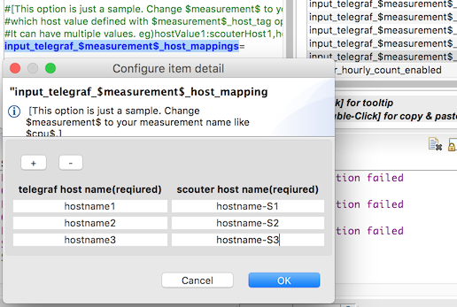
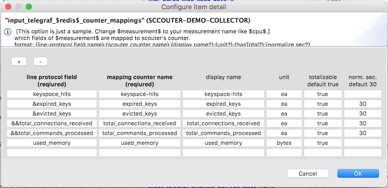

# Telegraf Server Feature
[](Telegraf-Server.md) [](Telegraf-Server_kr.md)

Scouter collector의 Telegraf Server 기능을 사용해 Telegraf와 통합해 사용할 수 있다.
Scouter collector는 현재 Telegraf의 HTTP output과 연동이 가능하며 telegraf-scouter 전용 output이 제공될 예정이다.
  - [Telegraf HTTP Output plugin](https://github.com/influxdata/telegraf/tree/master/plugins/outputs/http)

Telegraf의 Input Plugin을 통해 다양한 제품의 성능 정보를 모니터링 할 수 있으며 현재 제공되는 Input들은 telegraf plugin 페이지를 참고한다.
  - [Telegraf HTTP Input plugin](https://github.com/influxdata/telegraf/tree/master/plugins/inputs)


## Telegraf Server 기능 적용

### 1. Telegraf Server 옵션 활성화
먼저 Collector의 http server 기능이 활성화 되어야 한다.
  - `net_http_server_enabled=true`

그리고 telegraf server 기능을 활성화 한다.
  - `input_telegraf_enabled=true`

만약 http port를 변경하고 싶다면 `net_http_port` 를 변경한다. 기본값은 6180 이다.
위 옵션을 변경하였으면 collector를 재시작하여야 한다.

Debug가 필요한 경우 `input_telegraf_debug_enabled`을 true로 설정하면 요청되는 모든 데이터를 로깅한다.

### 2. Telegraf Http output 설정
Telegraf output의 end point를 위에서 설정한 scouter server로 설정한다.
```javascript
  [[outputs.http]]
    url = "http://my-scouter-server:6180/telegraf/metric"
    timeout = "5s"
    method = "POST"
    data_format = "influx"
```

Scouter는 2초마다 요청을 처리하고 실시간 차트를 주로 활용하므로 telegraf의 요청 간격도 가능한 2초 ~ 10초 사이로 조절한다.
```javascript
[agent]
  ...
  interval = "4s"
  ...
  flush_interval = "4s"
```

### 3. Scouter Collector 에 counter mapping 설정
모니터링 할 Telegraf의 measurement의 field를 scouter의 counter에 mapping 해야한다.
여기선 몇가지 작업이 필요한데 요약하면 아래와 같은 항목들을 설정한다.
 - line protocol measurement를 scouter counter의 family로 설정
 - object type을 설정 (한번에 모니터링할 그룹 - 일반적으로 시스템 구분과 동일)
 - object name을 설정 (어느 서버의 성능 정보인가?)
 - line protocol field를 counter에 매핑

아래 항목들로 설정하는데 중간에 $measurement$를 실제 measurement 이름으로 대체한다.
항목에 값이 있는 부분은 기본값을 나타낸다.
```ini
input_telegraf_$measurement$_debug_enabled=false
input_telegraf_$measurement$_objFamily_base=
input_telegraf_$measurement$_host_tag=host
input_telegraf_$measurement$_host_mappings=
input_telegraf_$measurement$_objName_base=
input_telegraf_$measurement$_objName_append_tags=
input_telegraf_$measurement$_objType_base=
input_telegraf_$measurement$_objType_prepend_tags=scouter_obj_type_prefix
input_telegraf_$measurement$_objType_append_tags=
input_telegraf_$measurement$_tag_filter=
input_telegraf_$measurement$_counter_mappings=
```
예를 들어 measurement가 redis라면 `input_telegraf_$measurement$_debug_enabled`는 `input_telegraf_$redis$_debug_enabled`가 된다.

telegraf의 redis input을 예를 들어 설명해 보겠다.

#### 3.1. Family 설정
Family는 동일한 성능 metric를 가지는 단위라고 생각하면 된다.
예를 들어 Host Family는 cpu, memory, disk io 등의 성능 메트릭을 가진다.
Family를 redis로 설정하자.
```ini
#이미 제공되는 family와 이름 중복을 막기위해 X$redis 라는 이름으로 Family가 등록된다.
input_telegraf_$redis$_objFamily_base=redis
```

#### 3.2. Host Mapping 설정
여러대의 장비에서 성능 정보를 전송하므로 Host 정보는 필수이다.
보통 기본 설정으로 잘 동작하므로 설정을 변경할 필요는 없으나 간혹 특정 line protocol이 host tag를 가지지 않을 수 있으니 이런 경우는 다음 내용을 참고하여 설정하도록 한다.
일반적으로 line protocol의 `host` tag에 host name 정보가 전송되는데 만약 host 정보를 알 수 있는 tag가 `host`가 아니라면 아래 옵션으로 이를 변경할 수 있다.
  - `input_telegraf_$redis$_host_tag`

그리고 전송된 host name이 scouter에서 설정된 host name과 다르다면 이에 대한 mapping도 설정할 수 있다.
(일반적으로는 동일하다.)
  - `input_telegraf_$redis$_counter_mappings`
    - eg) `input_telegraf_$redis$_counter_mappings=hostname1:hostname-S1,hostname2:hostname-S2`
위와 같이 입력하는 경우 Scouter client의 화면을 이용하면 보다 쉽게 입력이 가능하다.
  - Client의 설정 입력 화면에서 `input_telegraf_$redis$_counter_mappings=` 이라고 입력하고 이를 더블클릭하면 아래와 같은 입력창을 통해 입력이 가능하다.



#### 3.3. Object name 설정
Scouter는 모니터링 대상을 object라고 부른다.
이 대상의 이름을 설정한다.
object name은 실제 `/host-name/object-name` 으로 설정되므로 host가 다르다면 object name이 중복되어도 상관없다.

```ini
input_telegraf_$redis$_objName_base=redis
input_telegraf_$redis$_objName_append_tags=port
```
`input_telegraf_$redis$_objName_append_tags`에 `port`를 설정했는데 이는 하나의 host에 여러개의 redis가 존재하는 경우를 가정한 설정이다.

telegraf를 통해 들어오는 입력값(line protocol)은 아래와 같은데

>redis,**host**=sc-api-demo-s01.localdomain,**port**=30779,**scouter_obj_type_prefix**=SC-DEMO,**server**=172-0-0-0.internal  keyspace_hits=5507814i,expired_keys=1694047i,total_commands_processed=17575212i 1535289664000000000

맨 앞의 `redis`는 **measurement**이고, 그 뒤에 나오는 `host`, `port`, `obj_type_prefix`, `server`는 **tag**이다.
이어 나오는 수치 정보는 line protocol 에서는 **field**라고 한다. 여기엔 `keyspace_hits`, `expired_keys`, `total_commands_processed`라는 field가 존재한다.

위 설정으로 정해지는 object name은 결국 **redis_30779** 가 된다.
만약 `input_telegraf_$redis$_objName_append_tags`를 `server,port`로 설정한다면, object name은 **redis_172-0-0-0.internal_30779**가 된다.

#### 3.4. Object type 설정
object type은 scouter에서 한번에 모니터링하는 대상의 집합이다.
일반적으로 하나의 system에 존재하는 동일한 Family들을 생각하면 된다.

예를 들어 Order 시스템의 여러 redis 인스턴스는 한번에 모니터링해야 하는 대상일 것이다.
이러한 단위를 scouter에서는 **object type**이라고 한다.
따라서 이 redis 인스턴스들의 object type을 정한다면, **ORDER\_SYSTEM\_redis**와 같은 식으로 정할 수 있을 것이다.
여기서 앞에 붙는 ORDER\_SYSTEM과 같은 prefix를 telegraf의 tag에 추가하고 scouter에서는 이를 조합하여 object type을 정하게 된다.
이 tag명은 `scouter_obj_type_prefix`이며 `input_telegraf_$redis$_objType_prepend_tags=xxx` 설정을 통해 변경할 수도 있다.

```ini
input_telegraf_$redis$_objType_base=redis
#input_telegraf_$redis$_objType_prepend_tags=scouter_obj_type_prefix
#input_telegraf_$redis$_objType_append_tags=
```
이렇게 설정하면 object type은 **X$SC-DEMO_redis**가 된다.

telegraf에 tag를 추가할 수 있는 여러가지 방법이 있는데 가장 쉬운 방법은 global tag로 설정하는 방법이다.
이 외에 각 input 별로 설정하는 등 다양한 방식으로 설정이 가능하다.
```javascript
[global_tags]
  ## 기본 제공되는 object type과 중복 방지를 위해 X$는 자동으로 붙는다.
  scouter_obj_type_prefix = "SC-DEMO"
```

#### 3.5. Counter mapping 설정
이제 line protocol의 field를 scouter의 counter로 설정한다.
```ini
input_telegraf_$redis$_counter_mappings=keyspace_hits:ks-hits:ks-hits:ea:true,&expired_keys:expired::ea:true
```
위와 같이 모니터링할 field에 대한 정보를 comma로 구분하여 명시해 준다.
여기서 설정되지 않은 field는 버려지므로 모니터링 대상이 아닌 field는 telegraf에서 버려지도록 처리하여 scouter로 전달되지 않도록 하는 것이 더 좋다.
각 field의 설정 항목은 colon으로 구분되는데 내용은 아래와 같다.
 - **fn:cn:cd?:u?:t?:s?**
   - `fn` - field name, **required**
     - line protocol에서 전달되는 field명이다.
     - 만약 이 이름앞에 &를 붙이게 되면 delta counter로 지정된다.
       - delta counter는 초당 변경량을 보여주는 counter이다.
     - 만약 이 이름앞에 &&를 두개 붙이게 되면 normal counter와 delta counter를 둘 다 보여주게 된다.
   - `cn` - counter name, **required**
     - scouter에서의 counter 명이다.
   - `cd` - counter desc - optional, default : counter name
     - scouter에서 해당 counter를 화면에 표시할때 사용되는 값이다.
   - `u` - unit - optional
     - 해당 값의 단위이다.
   - `t` - totalizable - optional, default : true
     - 여러개의 값을 summarize하여 보여줄 수 있는지 여부이다.
     - 예를 들어 throughput은 true이고 memory 사용율은 false이다.(여러 VM의 memory 사용율을 sum하여 보여주면 이상하다.)
     - 이 값이 true인 경우 scouter의 화면에서 total 차트를 열 수 있다.
   - `s` - nomalizing seconds
     - counter의 평균값을 구하는 time window의 값이다.
     - default 0s, delta counter의 경우는 30s이다.

마찬 가지로 client 화면을 통해 보다 쉽게 설정할 수 있다.




#### 3.6. Counter mapping - tag filter
전송되는 항목중에 특정한 tag 값을 가지는 경우만 수집할 수 있다.
예를 들어 4개의 cpu를 가진 VM의 cpu 정보를 수집하는데 이때 각 cpu별 사용량, 전체 cpu의 사용량이 모두 수집되고 이를 특정 tag값으로 구분할 수 있다..
만약 `cpu` tag의 값이 cpu-total, cpu-0인 경우만 수집하기를 원한다면 아래와 같이 설정한다.
```ini
input_telegraf_$cpu$_tag_filter=cpu:cpu-total,cpu:cpu-0
```

만약 `cpu` tag의 값이 cpu-total만 제외하고 수집하고 싶다면 이렇게 설정한다.
```ini
input_telegraf_$cpu$_tag_filter=cpu:!cpu-total
```


### 4. counters.site.xml 확인
위와 같이 설정한 후 telegraf를 통해 해당 정보가 scouter collector로 들어오면 counter에 대한 meta 정보가 counters.site.xml에 자동으로 등록된다.
설정에서 삭제한다고 해당 counter의 meta 정보가 삭제되지는 않는다.
이를 삭제하기 위해서는 counters.site.xml에서 직접 삭제하여야 하며 특히 여러번 수정하면 동일한 type들의 garbage가 남을 수 있으므로 이때는 counters.site.xml에서 이를 확인하고 적절히 수정하도록 한다.
(counters.site.xml을 수정하면 collector server를 재시작하여야 한다.)

counters.site.xml은 collector의 conf 디렉토리에 위치한다.

  - counters-site.xml 예제 (간략하게 수정됨)
```xml
<Counters>
<Types>
    <ObjectType disp="SC-DEMO_java" family="javaee" icon="tomcat" name="SC-DEMO_java"/>
    <ObjectType disp="SC-DEMO_mysql" family="X$mysql" icon="mysql" name="SC-DEMO_mysql"/>
    <ObjectType disp="SC-DEMO_redis" family="X$redis" icon="redis" name="SC-DEMO_redis"/>
    <ObjectType disp="SC-DEMO_nginx" family="X$nginx" icon="nginx" name="SC-DEMO_nginx"/>
  </Types>

  <Familys>
    <Family name="X$mysql">
      <Counter disp="com_update_$delta" name="com_update_$delta" unit="/s"/>
      <Counter disp="connections" name="connections" unit=""/>
    </Family>
    <Family name="X$redis">
      <Counter disp="total_commands_processed" name="total_commands_processed" total="true" unit="ea"/>
      <Counter disp="total_commands_processed_$delta" name="total_commands_processed_$delta" unit="ea/s"/>
    </Family>
    <Family name="X$nginx">
      <Counter disp="active-conn-working" name="writing" total="true" unit="ea"/>
      <Counter disp="requests_$delta" name="request-count_$delta" total="true" unit="ea/s"/>
    </Family>
  </Familys>
</Counters>
```

