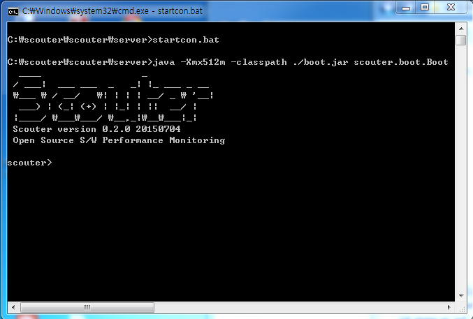

# Console Mode로 시작하기
 

Scouter는 특별한 환경(클라이언트를 사용할 수 없는 환경)을 위해
콘솔모드로 모니터링 할 수 있는 방법이 제공된다. 이렇게 모니터링하는 기능이 부족하기 때문에 
임시로만 사용해야한다.

다음과 같은 경우에 콘솔 모드를 사용할 수 있다.

1. 서버와 클라이언트 사이의 방화벽이 개방되지 않은 경우
2. 서버와 클라이언트 사이에 네트웍 환경이 좋지 않은 경우

클라이언트가 서버에 접속할 수 없는 상황에서 유용하게 사용될 수 있다.

서버를 실행할때 startcon.sh를 사용하면 다음과 같이 명령을 위한 프롬프트가 나타난다. 
  

참고할 점은

1. 콘솔을 정지하면 서버가 정지된다. 따라서 데몬으로 실행전환하고자 하면 재기동해야한다.
2. 콘솔모드라도 모든기능은 일반기동과 동일하게 동작한다. 

