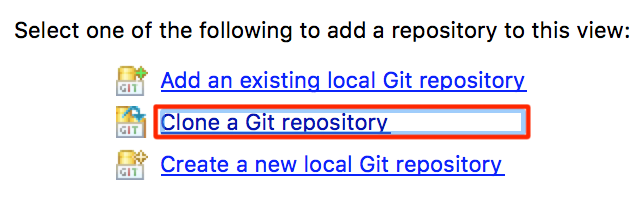
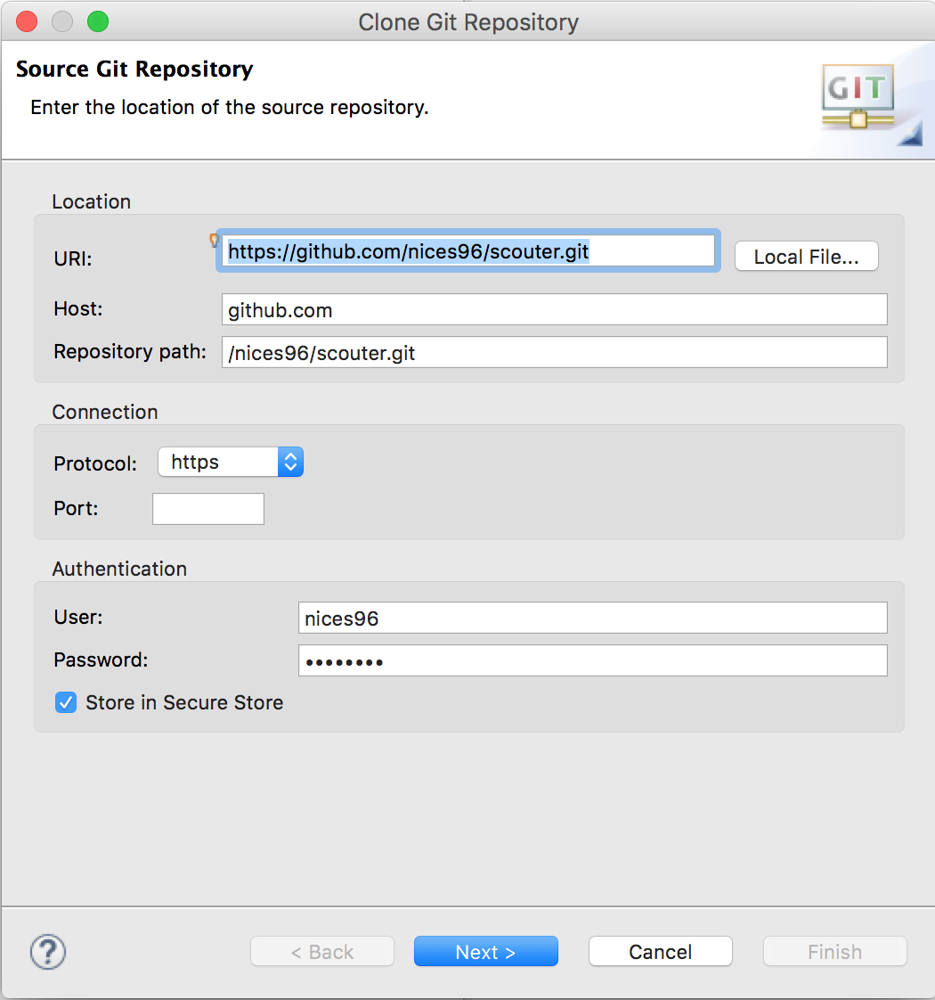
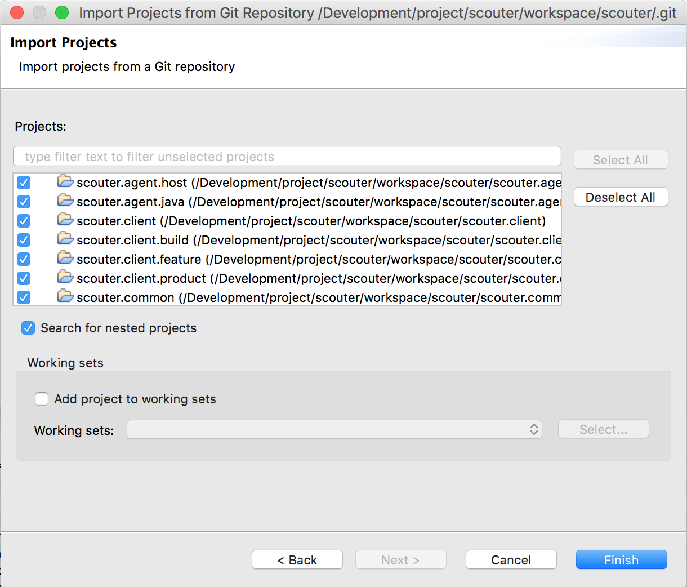
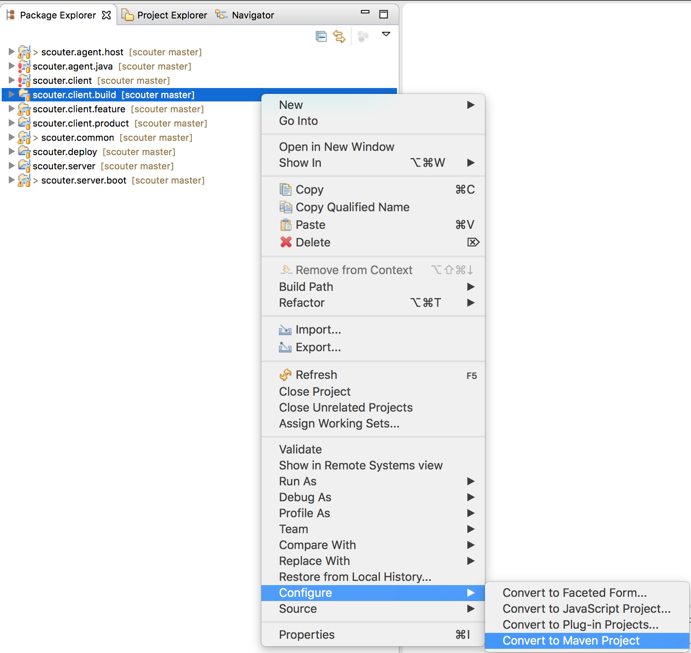
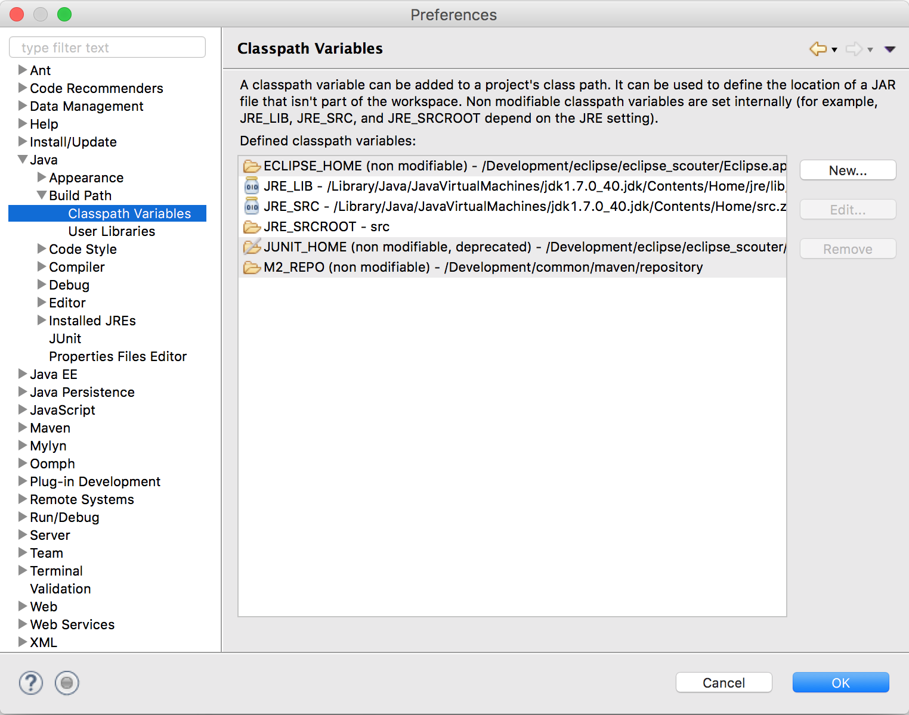
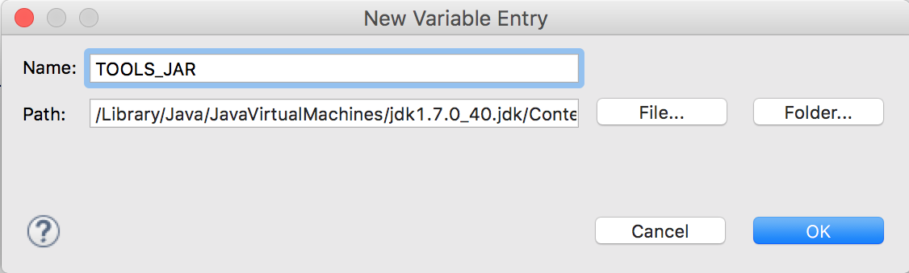
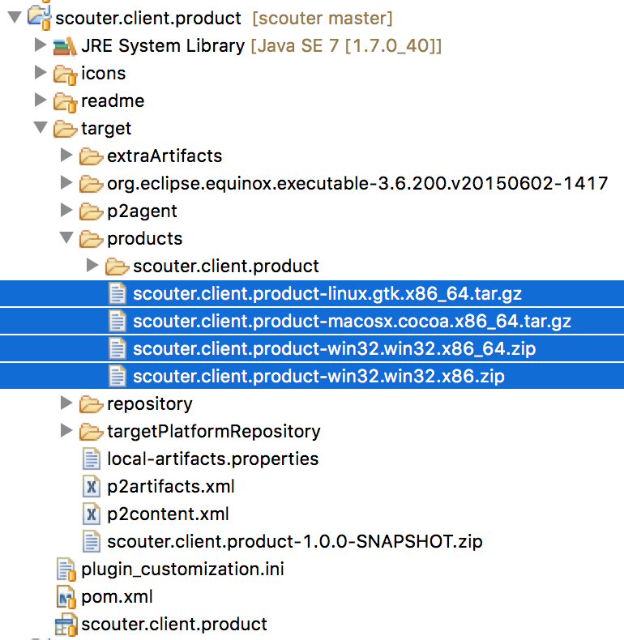
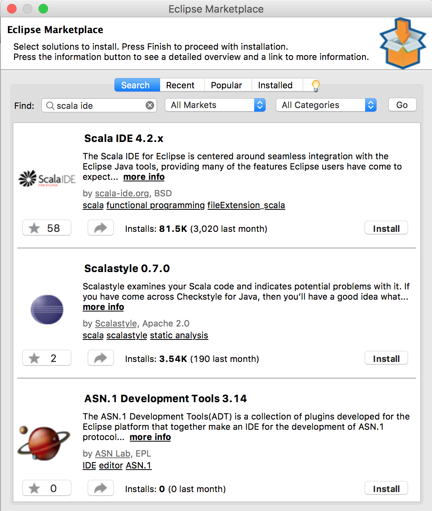

# Scouter Developer Guide
[](Developer-Guide.md) [](Developer-Guide_kr.md)

## You can import scouter project as maven project.

* build
  - server & agent : ```mvn clean package```
  - client : ```mvn -f ./scouter.client.build/pom.xml clean package ```

* import project to the IDE
  - Scouter project : import maven project using the parent pom.
  - Scouter client project (for Eclipse Neon+)
    - build server & agent first then it makes scouter.common.jar and register it for client project library.
    - use "import existing maven project"
       - select the directory, ./scouter.client.build/pom.xml (It's parent pom)
    - If your eclipse doesn't have ZEST plugin, you should install it.
       - Help > Install New Software : Work with : http://download.eclipse.org/tools/gef/updates/releases/
         - And then install GEF(Graphical Editing Framework)


# contents below are deprecated.

## Git Fork
* browse https://github.com/scouter-project/scouter and fork it.
> 

## make development environment
##### 1. Install Eclipse #####
* Download Eclipse(Java EE Developers) : https://www.eclipse.org/downloads/
* Extract and run it.

##### 2. Open git perspective #####
>

>

##### 3. copy scouter url #####
* https://github.com/${account}/scouter.git

##### 4. Click - Clone a Git repository #####
>

##### 5. paste the url copied and click next #####
>

##### 6. Choose branch and click next #####
>

##### 7. Choose repository for clone #####

>

> **Check "Import all existing Eclipse project after clone finishes" for auto import.**

##### 8. Import Projects #####
>

##### 9. Choose Import existing Eclipse projects #####
>

##### 10. Click Finish #####
>

##### 11. It can be shown in Java EE perspective #####
>

##### 12. Change to Maven Project #####
* change scouter.client.build project to Maven Project

>

##### 13. add "TOOLS_JAR" Classpath Variable #####
* Eclipse Prefrences : Java -> Build Path -> Classpath Variables

>

* Name : "TOOLS_JAR", choose $JAVA_HOME/lib/tools.jar for Path

>

##### 14. plugin install : Zest for client build error
* Help -> Eclipse Marketplace : searching Zest
 of (http://download.eclipse.org/tools/gef/updates/releases/)

>

##### 2. Client Build #####
* mvn clean package on scouter.client.build/pom.xml

* artifact location : target/products

>

## Appendix
##### Install Scala IDE(for scouter.server) #####
* Help - Eclipse Marketplace : search "scala ide"

>

* Install Scala IDE 4.2.x

