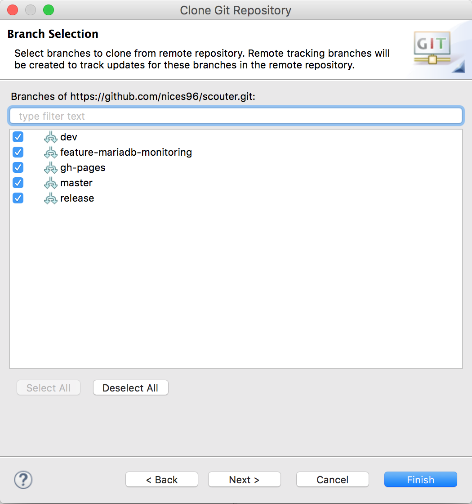

# Scouter Developer Guide
 

* This document is deprecated. You can import scouter project as maven project.
 
본 문서에서는 Eclipse 기반의 Scouter 개발 및 빌드환경 구성을 가이드한다. 

## Git Fork
* https://github.com/scouter-project/scouter에 접속하여 본인 계정으로 로그인 후 Fork 버튼을 클릭한다.

>

## 개발 환경 구성
##### 1. Eclipse 설치 #####
* https://www.eclipse.org/downloads/ 에서 최신 버전의 Eclipse(Java EE Developers)를 다운로드한다.
* 사용하고자 하는 경로에 압축 해제 후 Eclipse를 실행한다.

> **JDK가 설치되어 있지 않다면 http://www.oracle.com/technetwork/java/javase/downloads/java-archive-downloads-javase7-521261.html 에서 다운로드하여 설치한다. (JAVA_HOME, PATH 등의 환경설정이 필요할 수 있음)**

##### 2. Git Perspective를 Open 한다. #####
>

>

##### 3. Fork 된 Scouter URL을 복사한다. #####
* https://github.com/${account}/scouter.git

##### 4. Eclipse의 Git Repositories 탭에서 "Clone a Git repository"를 클릭한다. #####
>

##### 5. Location URI에 복사된 Scouter URL을 입력하고 Next 버튼을 클릭한다. #####
>

##### 6. Clone 대상 Branch를 (전체) 선택하고 Next를 클릭한다. #####
>

##### 7. Clone이 저장될 Local Repository를 선택한다. #####
* Destination Directory를 workspace 내로 지정할 경우 Git Local Repository를 Eclipse의 프로젝트에서 같이 사용할 수 있다.

>

> **Import all existing Eclipse project after clone finishes를 체크할 경우 자동으로 import 된다.**

##### 8. Clone된 scouter repository에서 마우스 우측 버튼을 클릭하고 Import Projects를 선택한다. #####
>

##### 9. Import existing Eclipse projects를 선택하고 Next를 클릭한다. #####
>

##### 10. Import 대상 프로젝트를 (전체)선택하고 Finish 버튼을 클릭한다. #####
>

##### 11. Java EE perspective에서 Import 된 프로젝트 목록을 확인할 수 있다. #####
>

##### 12. Maven Project로 변환 #####
* scouter.client.build 프로젝트를 Maven Project로 변환한다.

>

##### 13. scouter.agent.java 프로젝트에서 발생하는 Problem을 해결하기 위해 "TOOLS_JAR"라는 Classpath Variable을 추가한다. #####
* Eclipse Prefrences 창을 열고 Java -> Build Path -> Classpath Variables를 선택한다.

>

* New 버튼을 클릭한다.
* Name 항목에 "TOOLS_JAR", Path 항목에 $JAVA_HOME/lib/tools.jar 파일을 선택한다.

>

##### 14. scouter.client 프로젝트에서 발생하는 Problem을 해결하기 위해 Zest 관련 플러그인을 설치한다. 
* Help -> Eclipse Marketplace를 선택하고 Zest를 입력하여 검색한다.
* Ant Visualization 1.0.0을 선택하여 Install한다. (라이선스 동의 및 Eclipse 재구동 필요)

>

##### 15. scouter.client 프로젝트에서 발생하는 또 다른 Problem을 해결하기 위해 패키지 빌드를 수행한다. #####
* scouter.deploy 프로젝트의 build.xml 파일을 실행한다.

>

* 빌드 후 scouter.client 프로젝트의 lib 폴더를 Refresh 하면 scouter.common.jar 파일이 생성되며 Problem이 해결된다.

## Branch 변경
* Git Perspective 화면에서 scouter -> Branches -> Remote Tracking에서 변경하고자 하는 branch를 선택(더블클릭) 한다.

>

* Checkout as New Local Branch를 클릭한다.

>

* Branch name을 확인하고 Finish 버튼을 클릭한다.

>

* Local Branches에 새로운 branch가 생성된 것을 확인할 수 있다.

>

>**Local Branches에 있는 branch는 이후 Team -> Switch To 메뉴 또는 Git Repositories 탭에서 선택하여 변경할 수 있다.**

## Build
##### 1. Package(Agent, Host, Server) Build #####
* scouter.deploy 프로젝트의 build.xml 파일을 실행한다.

>

* scouter.deploy 프로젝트를 Refresh 하면 out 폴더에 패키징된 파일이 생긴 것을 확인할 수 있다.

>

##### 2. Client Build #####
* scouter.client.build 프로젝트를 선택하고 Maven Install을 실행한다.

>

* scouter.client.product 프로젝트를 Refresh 하면 target/products 폴더에 OS Architecture 별로 패키징된 파일이 생긴 것을 확인할 수 있다.

>

## Pull Request
**변경된 소스를 반영시키기 위해 Commit & Push 후 Pull Request를 수행한다.**
* 변경된 소스에 대해여 Commit & Push를 수행한다.

>

* https://github.com/${account}/scouter.git에 접속하여 Compare & pull request 버튼을 클릭한다.

>

* scouter-project/scouter의 Branch가 dev인지 확인 후 comment 작성 후 Create pull request 버튼을 클릭한다.

>

## Fork된 Repository를 최신으로 변경하기
개인 또는 조직의 Repository에 Scouter를 Fork 한 경우 다음 과정을 통해 최신 소스로 변경할 수 있다.

**git command를 이용한 sync도 가능하지만, 본 가이드에서는 Eclipse를 이용한 Sync 방법을 가이드한다.**

* Git Repositories 탭에서 scouter repository > Remotes 선택 후 마우스 오른쪽 버튼을 클릭하여 Create Remotes를 선택한다.

>

* Remote name에 "upstream"을 입력하고, Configure fetch를 선택 후 OK 버튼을 클릭한다.

>

* Change 버튼을 클릭하고 URI에 "https://github.com/scouter-project/scouter.git"를 입력 후 Finish 버튼을 클릭한다.

>

>

* Save 버튼을 클릭한다. 여기까지는 upstream이 없는 경우에 해당하는 내용으로 이미 upstream을 생성한 경우에는 아래의 Fetch 부터 수행하면 된다.

>

* upstream으로부터 Fetch를 수행하면 최신 정보를 내려받는다.

>

>

* Branches > Remote Tracking에 upstream으로부터 내려받은 branch 항목들이 표시되며, 현재 Local에 선택된 branch와 동일한 upstream의 branch를 선택후 Merge를 수행한다.

>

>

* Push to Upstream을 통해 자신의 원격 Repository로 변경 내용을 저장한다.

>

* Push가 완료되고 index 및 Message가 동일해진 것을 확인할 수 있다.

>

>

이상의 작업은 branch 별로 동작하므로 최신으로 변경하고자 하는 branch가 더 있을 경우 해당 Local branch를 선택하고 위의 Merge 이후 작업을 반복한다.

만약 소스가 변경되어 자신의 Remote Repository에 push 되어 있는 경우에는 Merge 작업 시 두 branch가 병합되어 새로운 index가 생성된다.

이때 Pull Request가 아닌 upstream의 branch와 동일하게 맞추길 원하는 경우 다음과 같이 진행한다.

* upstream으로부터 Fetch를 수행한다.

* 현재 Local에 선택된 branch와 동일한 upstream의 branch를 선택후 Hard Reset을 수행한다.

>

>

* Local branch를 선택 후 Push Branch를 수행한다.

>

* "Force overwrite branch in remote if it exists and has diverged"를 체크하고 Next 버튼을 클릭한다.

>

* Confirm을 수행 후 Push Branch가 완료되면 Local, Remote, Upstrem의 해당 branch가 완벽히 일치된 것을 확인할 수 있다.

>

>

>

## Appendix
##### Scala IDE 설치하기(scouter.server 프로젝트가 scala로 구현되어 있음) #####
* Help - Eclipse Marketplace 창을 열고 "scala ide"로 검색한다.

>

* Scala IDE 4.2.x를 설치한다.(라이선스 동의 및 재구동 필요)

##### Scouter Client 실행하기 #####
* scouter.client.product 프로젝트의 scouter.client.product 파일을 열고 Overview 탭을 선택한다.
* Testing 항목의 Launch an Eclipse application을 클릭한다.

* Trouble shooting
	* Caused by: java.lang.UnsupportedClassVersionError: scouter/client/Application : Unsupported major.minor version 52.0
		* Window - Preferences 창을 열고 Java -> Compiler의 Compiler compliance level이 1.7인지 확인한다.
		

		* scouter.client, scouter.client.product 프로젝트의 JRE System Library가 1.7인지 확인한다.
		