# External Interface (Email, Telegram)
[](External-Interface.md) [](External-Interface_kr.md)

본 문서에서는 스카우터 서버에서 발생한 Alert 메시지를 Email과 Telegram 메신져로 전송하는 방법에 대해 소개합니다.

## 추가 Properties
스카우터 서버 설치 경로의 conf/scouter.conf 파일에 외부 연동을 위해 다음 항목을 추가로 정의합니다.

* 공통 항목
	* **_send\_alert\_level_** : 수신 레벨을 정의합니다.(0 : INFO, 1 : WARN, 2 : ERROR, 3 : FATAL) - 기본 값은 0

* Email 관련 항목
	* **_send\_alert\_via\_email_** : Email 발송 여부 (true / false) - 기본 값은 false
	* **_email\_smtp\_hostname_** : SMTP 서버의 IP 또는 Domain - 기본 값은 smtp.gmail.com
	* **_email\_smtp\_port_** : SMTP Port - 기본 값은 587
	* **_email\_username_** : Email 사용자 계정
	* **_email\_password_** : Email 사용자 비밀번호
	* **_email\_tls\_enabled_** : TLS 사용 여부 - 기본 값은 true
	* **_email\_from\_address_** : Email 발신자 계정
	* **_email\_to\_address_** : Email 수신 계정(다중 사용자 지정 시 ',' 구분자 사용)
	* **_email\_cc\_address_** : Email 참조 수신 계정(다중 사용자 지정 시 ',' 구분자 사용)
	
* Telegram 관련 항목
	* **_send\_alert\_via\_telegram_** : Telegram 메시지 발송 여부 (true / false) - 기본 값은 false
	* **_telegram\_bot\_token_** : 봇 토큰
	* **_telegram\_chat\_id_** : chat_id(Integer) 또는 채널 이름(String)

* Example
```
# External Interface
send_alert_level=0 // INFO Level 이상의 Alert을 전송

# External Interface (Email)
send_alert_via_email=true
email_smtp_hostname=smtp.gmail.com
email_smtp_port=587
email_username=scouter@gmail.com
email_password=******
email_tls_enabled=true
email_from_address=noreply@gmail.com
email_to_address=scoutertest@yopmail.com

# External Interface (Telegram)
send_alert_via_telegram=true
telegram_bot_token=185786411:AAGVaPyWCoZ8y1mTEGCV1jFmbLwpcjlsJoJY
telegram_chat_id=@ScouterDemoChannel
```

## 메시지 전송 결과(스크린샷)
* Email
>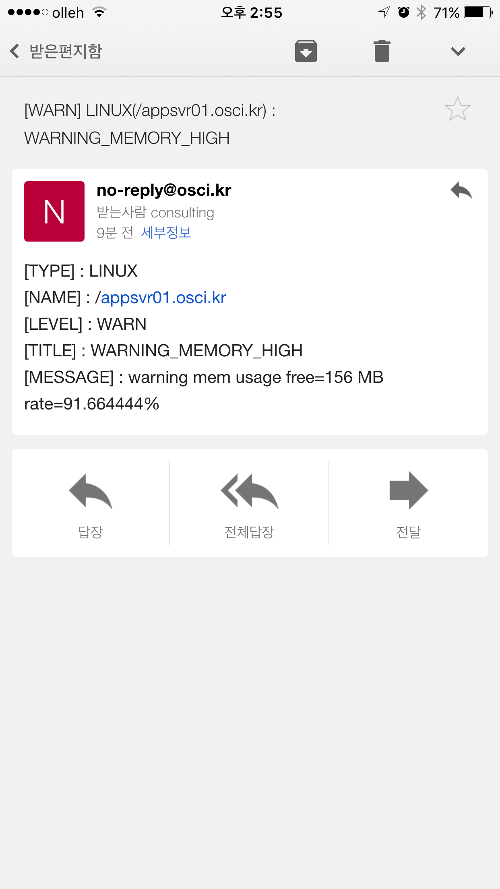

* Telegram
>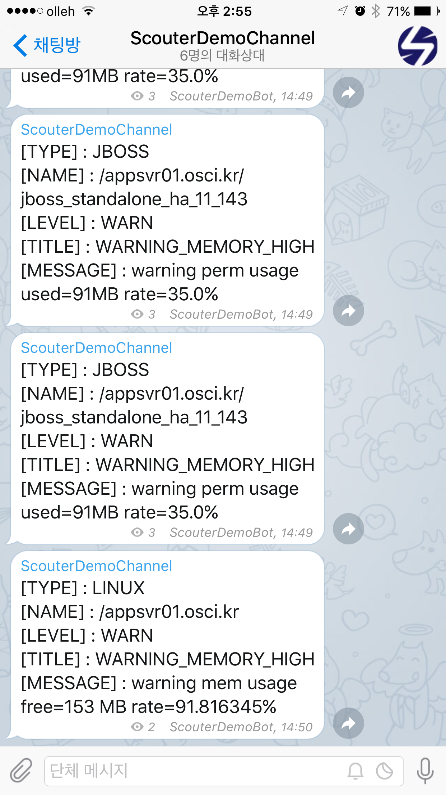


## Appendix
##### Telegram 데모 채널 #####
* https://telegram.me/ScouterDemoChannel 을 통해 Telegram 봇을 이용한 메시지 수신 기능을 확인할 수 있습니다.

##### Telegram Bot 생성 #####
* Telegram App에서 BotFather를 검색합니다.
>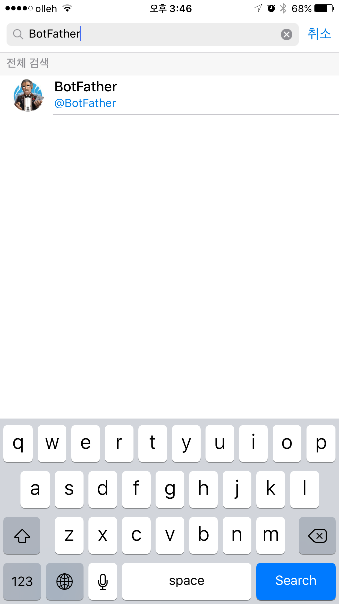

* BotFather를 통해 수행할 수 있는 명령어는 다음과 같습니다.
>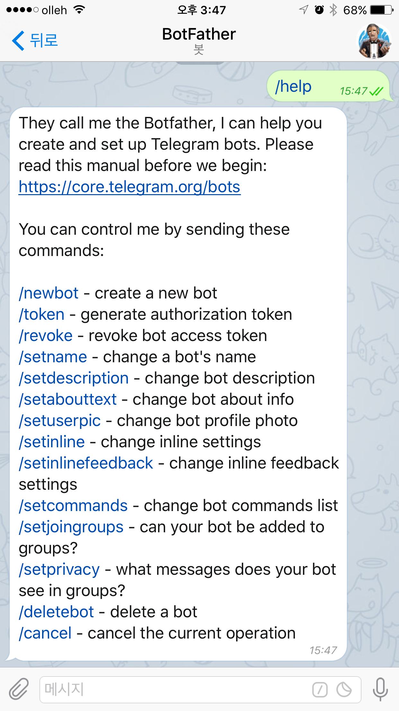

* /newbot을 입력하여 새로운 봇을 생성합니다.
>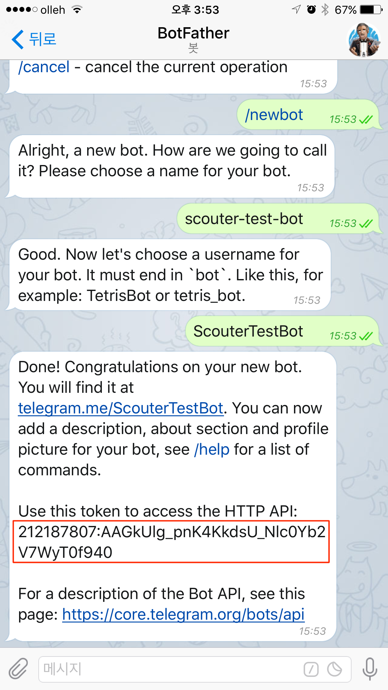

##### Telegram chat_id 조회 #####
* Telegram App에서 생성된 Bot을 검색합니다.
>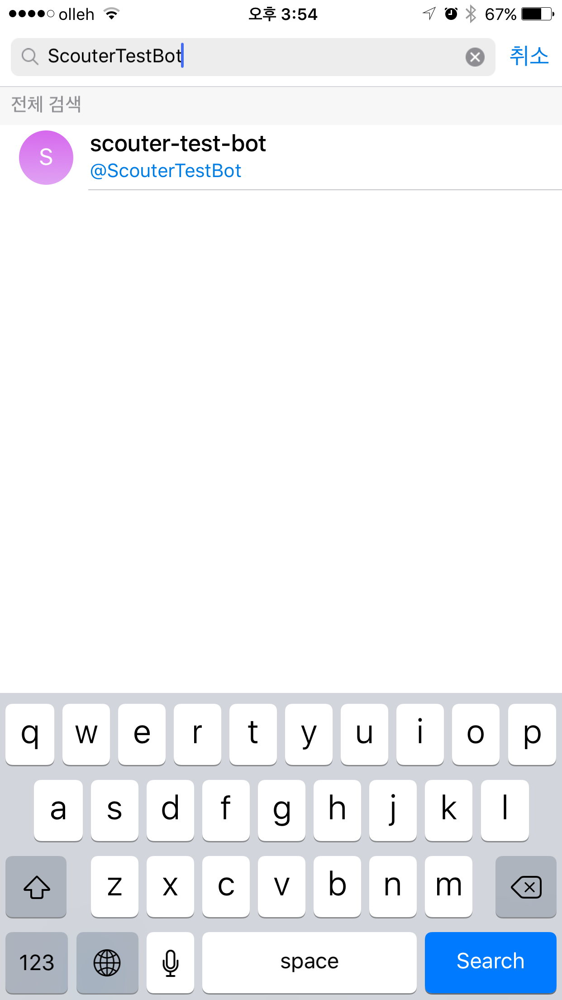

* 시작을 누릅니다.
>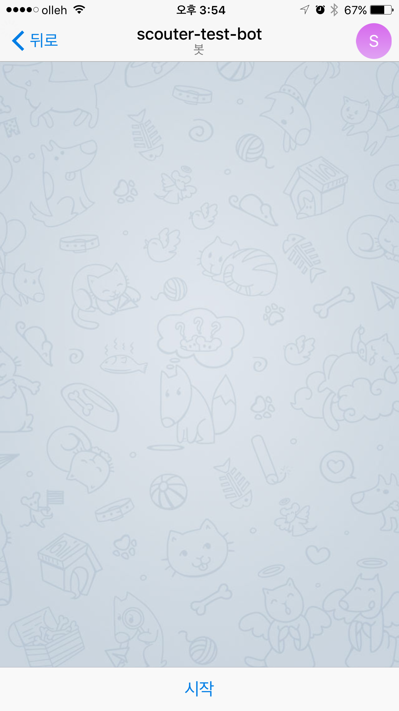
>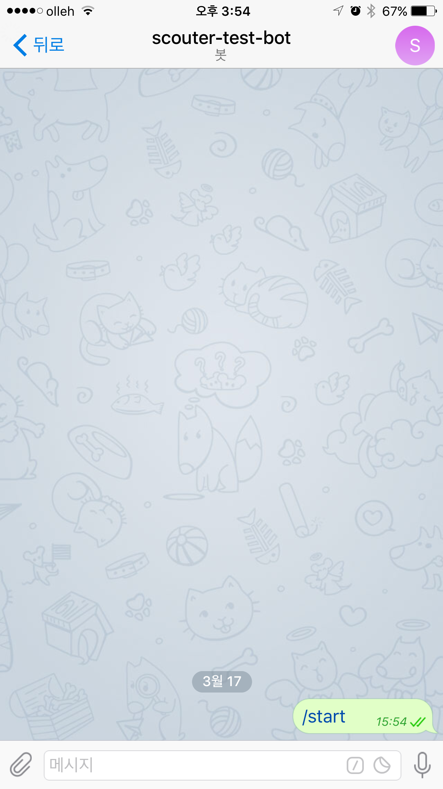

* 브라우져에서 https://api.telegram.org/bot{BOT_TOKEN}/getUpdates 를 호출합니다.
>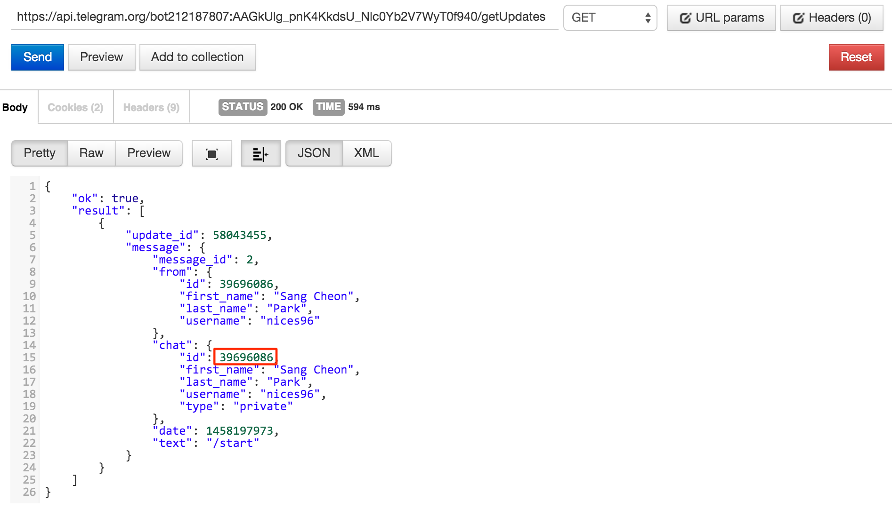

* chat id 값을 이용하여 대화창으로 메시지를 전송할 수 있습니다. (공개 채널의 경우 @{channelName}으로 메시지 전송 가능)
>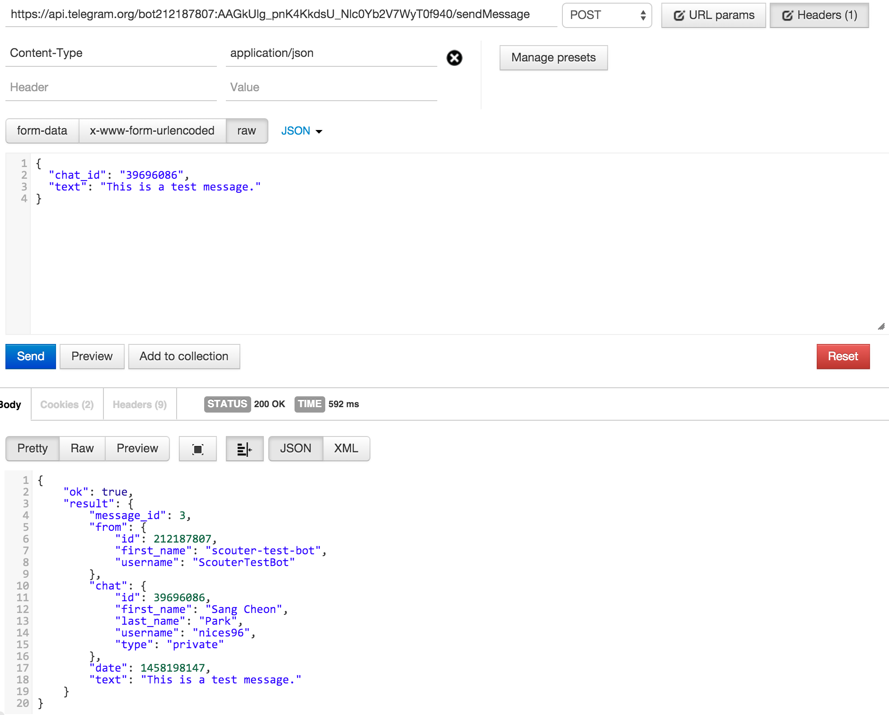
>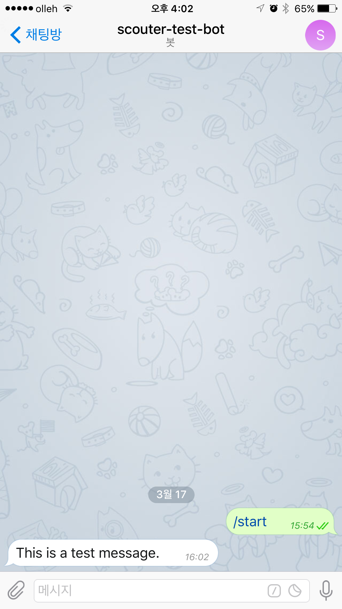