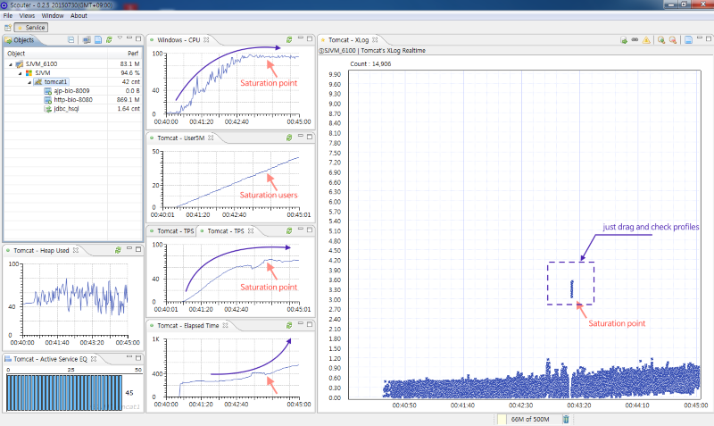

# Service Performance 101
 

In the beginning the performance management is to understand performance graphs.
If you do not understand the meaning of the graph even though no matter how much data to collect you can not solve the problem.

Below is a screen capture of the state monitored by the SCOUTER when increasing the performance test virtual users.

Basically, users calls the services. The services are using the resources. 
So, the relationship between them is important.

When the number of virtual users to infinitely increase then service throughput is increased to saturation point. And also the response time of the service is increased, and CPU usage become 100%.

This is no wonder, but in fact that is often ignored these principles.

For example, if the response is not slow down even though the number of users is increased then something is wrong. Do not forget the simple rules

CPU usage never become over 100%. 
No matter how many users, service TPS(transaction per second) is not increased over the max TPS without tuning activities. If the max TPS is not increased then the system is not tuned. Do not be fooled by response times