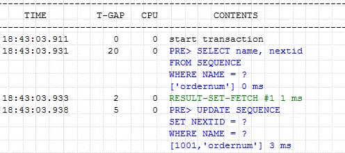
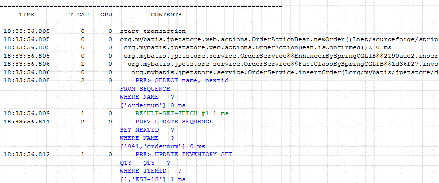

# Quick Start
[](Method-Profiling.md) [](Method-Profiling_kr.md)

Scouter defaults to profile http service start/end event and sqls only if you don't set any other profile options. 

But sometimes you need method level profiling, and you can set a few options for it. 
(The application should be started.) 

The demo system below shows a basic level profile information the case of no method profile option set. 
> Refer to [Quick Start Guide](../main/Quick-Start.md) for install the demo system. 




## Basic Options

Option              | desc
--------------------|-------
hook_method_patterns| method pattern signature to hook <br>use comma(,) to separate methods.<br> ` format : package.Class.method,package.Class2.method2`

```properties
hook_method_patterns = com.scouter.HelloWorld.hello
//hook_method_patterns = com.scouter.*.* //package : com.scouter, class : any, method : any
//hook_method_patterns = com.scouter.HelloWorld.* //package : com.scouter, class : HelloWorld method : any
```
On set `hook_method_patterns` option at the demo system and restart it, you can see the profile below that include the method information.



## Advanced Options

Option            | desc     | default
--------------------|-------  | -------
hook_method_ignore_prefixes| method prefix to exclude on a profiling | get,set 
hook_method_ignore_classes | classes pattern to exclude on a profiling | 
hook_method_access_public_enabled | profile public method | true 
hook_method_access_private_enabled | profile private method | false
hook_method_access_protected_enabled | profile protected method | false
hook_method_access_none_enabled | profile default method | false
