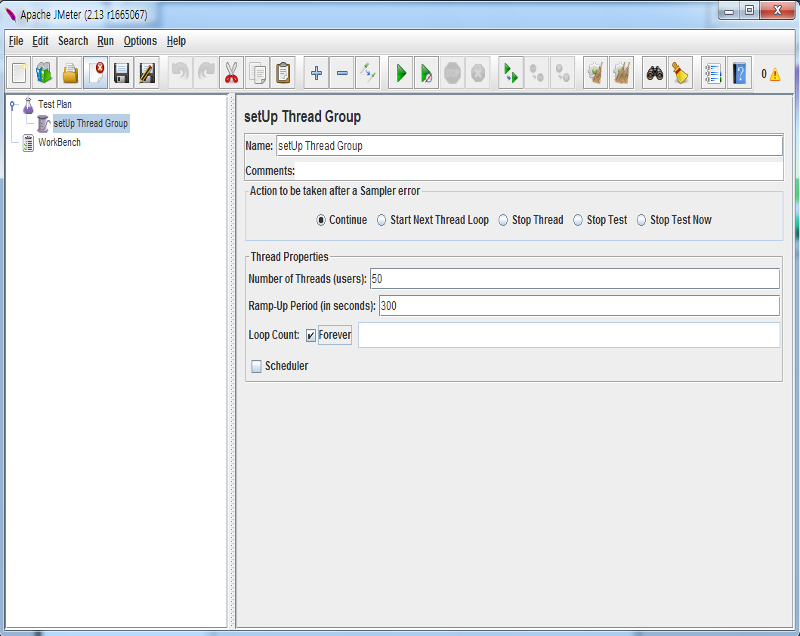
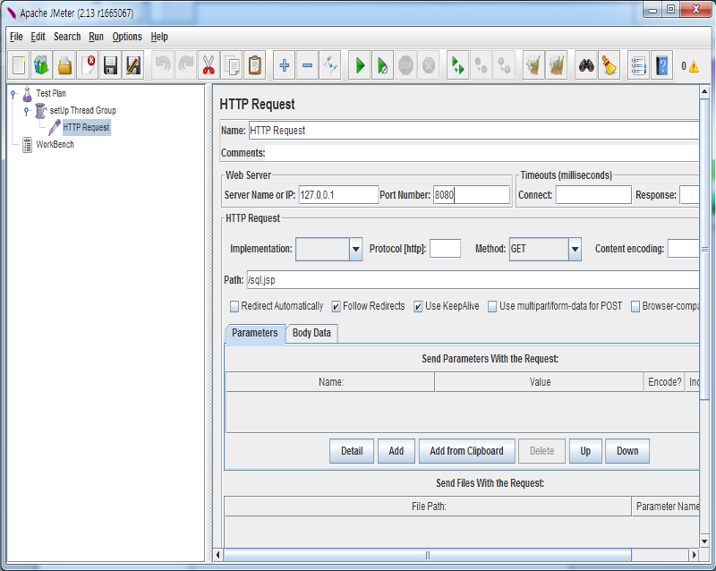
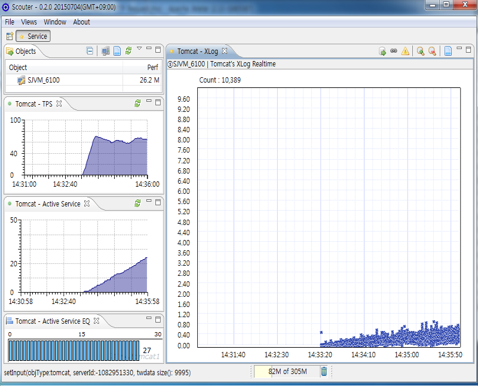
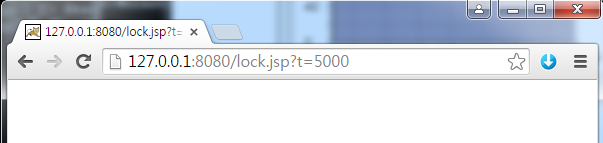
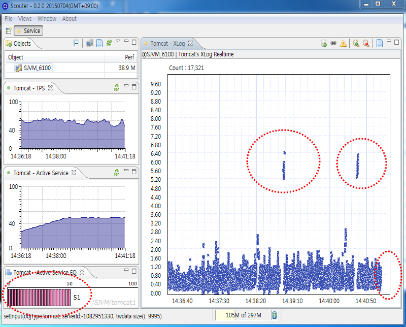
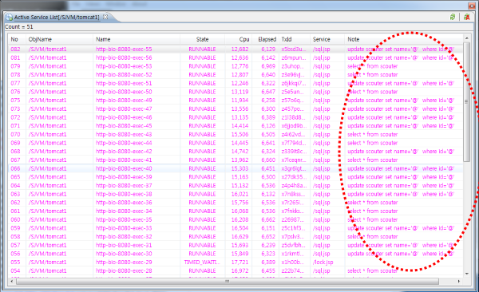
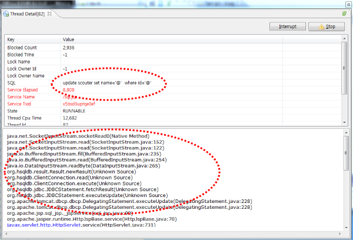
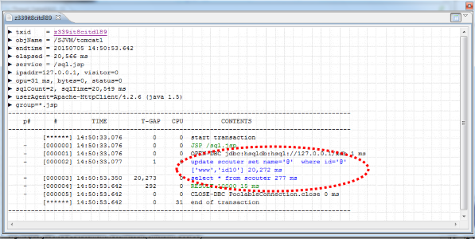

# Simulate DB Lock
[](Simulate-DB-Lock.md) [](Simulate-DB-Lock_kr.md)

This article describes how to simulate and monitor DB update lock with Scouter environment. Installation and configuration guide is [here](../main/Getting-Start-Profile-SQL.md).

### Installation Guide
1. JDK7 Installation ( [Getting Started](../main/Getting-Started.md) )
2. HSQLDB Installation ( [Getting Start Profile SQL](../main/Getting-Start-Profile-SQL.md) )
3. Tomcat Installation ( [Getting Started](../main/Getting-Started.md) )
4. JMeter Installation ( [Getting Start Profile SQL](../main/Getting-Start-Profile-SQL.md) )
5. Scouter Installation ( [Getting Started](../main/Getting-Started.md) )
6. Tomcat Configuration
   - DataSource ([Getting Start Profile SQL](../main/Getting-Start-Profile-SQL.md))
   - Deploy sample jsp pages,  
   [create.jsp](https://github.com/scouter-project/scouter-help/blob/master/misc/test-jsp/create.jsp), [sql.jsp](https://github.com/scouter-project/scouter-help/blob/master/misc/test-jsp/sql.jsp), [lock.jsp](https://github.com/scouter-project/scouter-help/blob/master/misc/test-jsp/lock.jsp) Copy these 3 files to ${TOMCAT_HOME}/webapps/ROOT/

   - Scouter Agent configuration ( [Getting Started](./Getting-Started) )

7. Startup all together
   - HSQLDB
```
     runServer.bat --database.0 file:mydb --dbname.0 xdb
```
   - Tomcat
```
set JAVA_HOME=c:\java7
set JAVA_OPTS=-javaagent:c:\scouter\agent\scouter.agent.jar
startup.bat
```
   - Scouter Server
   - Scouter Client

8. Scouter Client monitoring

### Run JMeter (Generating load)
Do load test about sql.jsp via JMeter.

>Left Window >> Test Plan (right mouse button) >> Add >> Threads(Users) >> SetUp Thread group



>> setUp Thread group(right mouse button) >> Add >> Sampler >> HTTP Request



Input these parameters,

* server ip : 127.0.0.1
* port : 8080
* Path : /sql.jsp

You can see the screen like below after clicking run button on JMeter.


> JMeter plugins : http://jmeter-plugins.org

### Simulate DB Update Lock
DB update lock will occur on lock.jsp page. Call this page with parameter 't' value to determine locking time.



You can see DB lock information at XLog and other chart on Scouter Client.



There are two steps to identify which business is making DB lock problem. First is checking active service list on left bottom on Client. Two is analyzing detailed transaction information of running service. After double clicking red bar, the detailed transaction information popup is displayed.

 



After the termination of service, profiles of tested transaction will be displayed on XLog chart.

