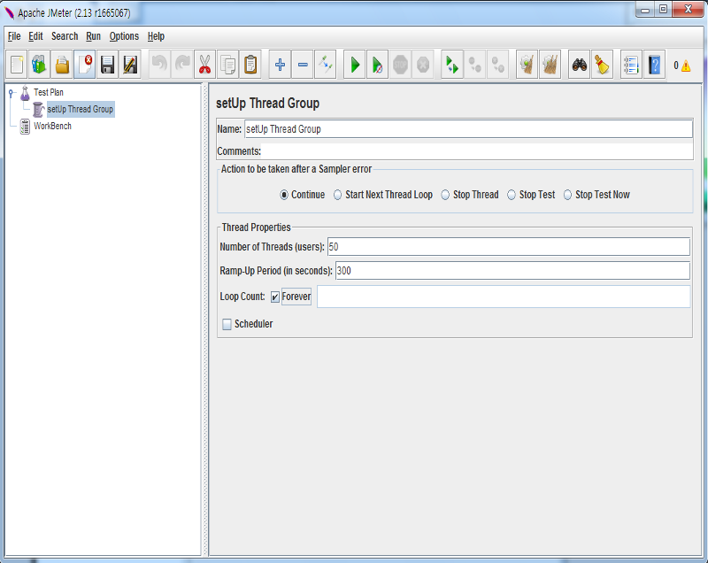
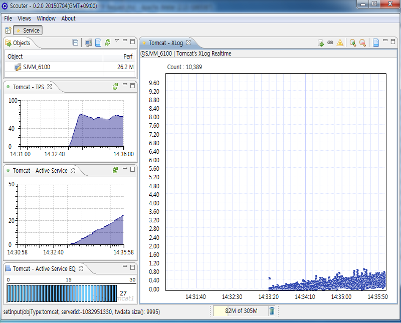
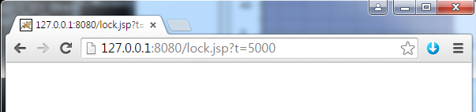
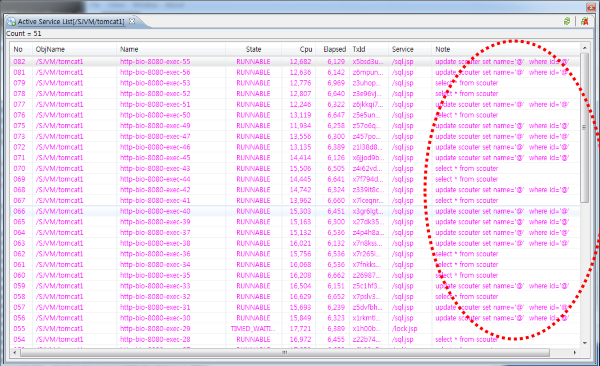

# Simulate DB Lock
[](Simulate-DB-Lock.md) [](Simulate-DB-Lock_kr.md)

본 문서는 간단하게 DB에 update lock이 걸렸을 때 어떻게 모니터링 되는지를 시뮬레이션한다.
기본적인 환경구성은 [Getting Start Profile SQL](../main/Getting-Start-Profile-SQL_kr.md)을 참조한다.

### 환경구성하기
1. JDK7설치 ( [Getting Started](../main/Getting-Started_kr.md) 참고 )
2. HSQLDB설치 ( [Getting Start Profile SQL](../main/Getting-Start-Profile-SQL_kr.md) 참고 )
3. Tomcat설치 ( [Getting Started](../main/Getting-Started_kr.md) 참고 )
4. JMeter설치 ( [Getting Start Profile SQL](../main/Getting-Start-Profile-SQL_kr.md) 참고 )
5. Scouter설치 ( [Getting Started](../main/Getting-Started_kr.md) 참고 )
6. Tomcat환경구성
   - DataSource설정 ([Getting Start Profile SQL](../main/Getting-Start-Profile-SQL_kr.md) 참고)
   - Sample jsp설치
   [create.jsp](https://github.com/scouter-project/scouter-help/blob/master/misc/test-jsp/create.jsp), [sql.jsp](https://github.com/scouter-project/scouter-help/blob/master/misc/test-jsp/sql.jsp), [lock.jsp](https://github.com/scouter-project/scouter-help/blob/master/misc/test-jsp/lock.jsp) 3개의 파일을  ${TOMCAT_HOME}/webapps/ROOT/.로 복사한다.

   - Scouter Agent설정 ( [Getting Started](../main/Getting-Started_kr.md) 참고 )

7. 모두 기동
   - HSQLDB
```
     runServer.bat --database.0 file:mydb --dbname.0 xdb
```
   - Tomcat
```
set JAVA_HOME=c:\java7
set JAVA_OPTS=-javaagent:c:\scouter\agent\scouter.agent.jar
startup.bat
```
   - Scouter Server
   - Scouter Client

8. Scouter Client 모니터링

### JMeter실행(부하발생)
JMeter를 실행하고 앞에서 설치했던 sql.jsp롤 호출하여 부하를 발생하는 테스트를 수행한다.

>죄측윈도우 >> Test Plan(우측마우스) >> Add >> Threads(Users) >> setUp Thread group



> setUp Thread group(우측마우스) >> Add >> Sampler >> HTTP Request


화면에서 다음값을 입력한다.

* server ip : 127.0.0.1
* port : 8080
* Path : /sql.jsp

실행버튼을 눌러 실행하면 다음과 같은 내용을 Scotuer클라이언트에서 볼 수 있다.


> 추가플러그인 설치 : http://jmeter-plugins.org

### Lock 유발시키기
lock.jsp를 호출하여 락을 유발시킬수 있다. 파라미터 "t"값을 통해 락 시간을 조절할 수 있다.



그러면 Scouter화면에서 XLog와 다른 차트를 통해 락이 발생하는 것을 볼 수 있다.


위 화면에서 어느 구간에서 지연이 발생하고 있는지 분석하기 위해서는 
두 가지 방법을 활용한다. 왼쪽 하단의 액티브서비스 리스트를 더블클릭해서 조회하면 진행중인 서비스 리스트를 볼 수 있고 상세 정보를 조회할수 있다. 아래 화면에서 두데이터 모두 많은 서비스들이 update SQL을 수행하고 있음을 알 수 있다.

 


만약 서비스가 종료되면 XLog화면에서 프로파일을 조회함으로 문제를 분석할 수있다. 

