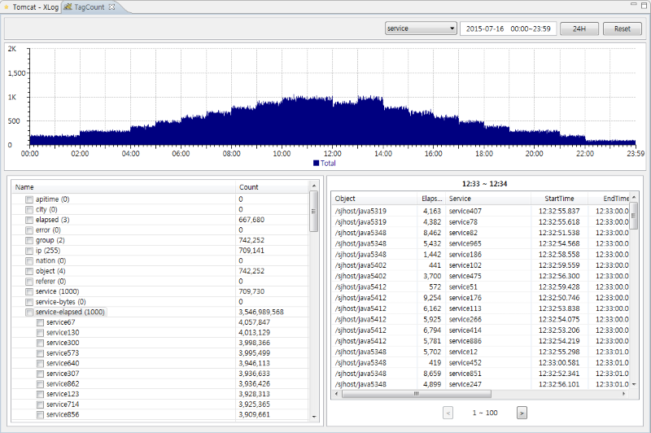
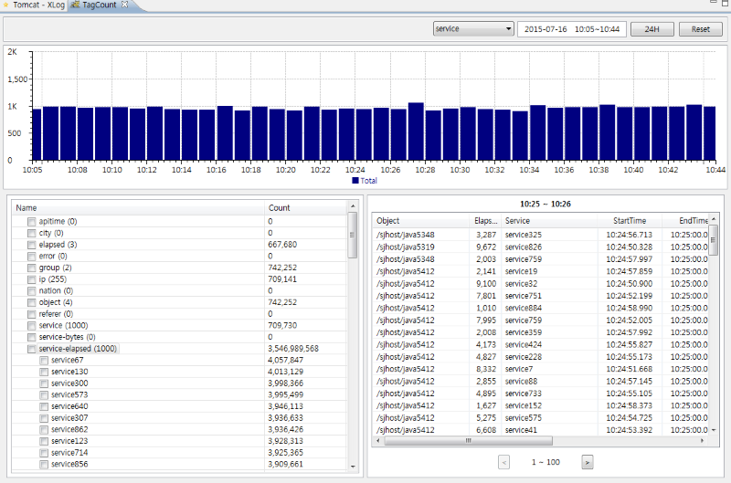

# TagCounting Analysis
[](TagCounting-Analysis.md) [](TagCounting-Analysis_kr.md)

Performance of service is measured by response time and the number of transactions. Speaking more accurately, by processed transactions per specified time unit and its processing time.

When many users use production system, each service on same system uses shared computational resources exclusively or not. To analyze the performance of system, we should take look at each service independently. XLog chart can help this. We also need statistical analysis as the usage of shared resources of one system can affect the other. TagCounting makes this more simple.

We call the result of one service as transaction. A transaction contains information about itself, URL of it, client IP address, user information and so on. Each information is called as tag. For example, IP address tag has the value of 192.168.10.10. Let's look at example transaction to clarify,

```
► objName = /sjhost/node1
► endtime = 20150717 09:12:37.919
► elapsed = 14,763 ms
► service = /sql.jsp
► ipaddr = 192.168.10.10
► userid = 1710040431418101372
► cpu=1 ms
► bytes = 25032
► status = 0
► sqlCount = 12
► sqlTime = 1,100 ms
► ApicallCount = 1
► ApicallTime = 10 ms
► userAgent = Java/1.7.0_55
► group = *.jsp
► login = joe
```

It is TagCounting that analyze processing statistics with each tag and their value. For example, list up a tag with 'ipaddr/192.168.10.10' of today to analyze a client behavior. Or sum up the number of transactions with tag 'userAgent/Java/1.7.0_55' of a day. With this action we can have intuitive view of characteristics of transactions.
 

Below is the statistical analysis example of 24 hours.


You can get the detailed graph of a time period specified by mouse dragging. And double-clicking any bar will show detailed transactions list.


You can check profiled information on each row.


Also select specific tag or its value.

