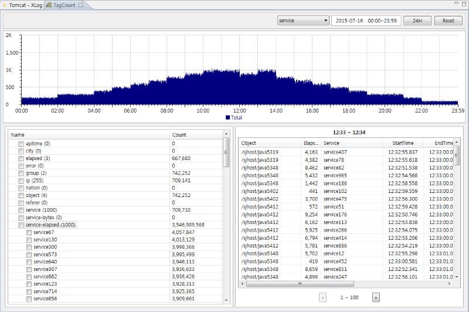
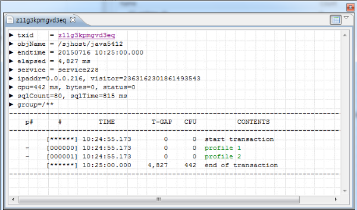
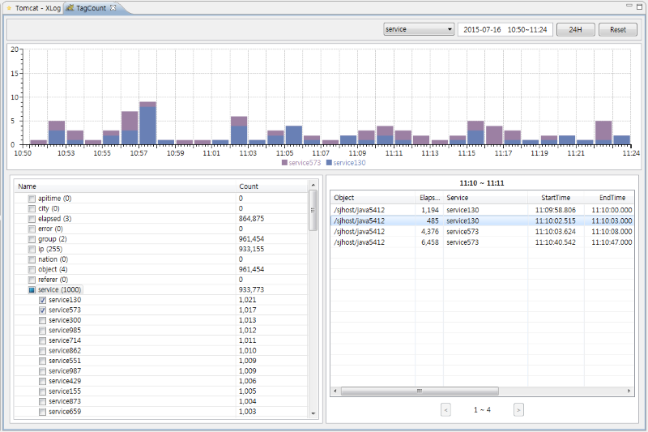

# TagCounting 분석기법
[](TagCounting-Analysis.md) [](TagCounting-Analysis_kr.md)

서비스 성능은 응답시간과 처리 건수로 측정된다.  더 정확히 이야기하면
단위 시간당 호출된 건수와 이것을 처리하기 위해 걸린 시간을 기준으로 서비스의 성능을 관리한다.

그런데 실제 환경에서 서비스는 다수의 사용자에 의해 다수의 서비스가 동시에 호출되며 이 서비스들은 다수의 서로 다른 자원들을 공유하거나 배타적으로 사용한다.
따라서 성능의 문제를 분석할 때는 이들 서비스를 개별로 분석해야만 서비스의 현황을 정확히 파악할 수 있다. 이렇게 만들어진 것이 응답시간 분포도(XLOG)이다. 
그런데 이들 서비스들은 독립된 공간에서 혼자 실행되는것이 아니고 서로다를 서비스들과 어떤 자원들을 공유하며 실행되기 때문에 통계적 분석이 (또한) 필요하게 된다. 이것을 위해 만들어진 기능은 TagCounting이다.

하나의 서비스가 수행되면 이것을 트랜잭션이라고 부른다. 
하나의 트랜잭션에는 여러가지 정보들을 가지고 있다. 어떤URL인지, 어떤 IP에서 호출했는지 혹은 어떤 사용자가 호출했는지 등등 이러한 정보들을 각각 테그라고 부른다.
예를 들어 ip라는 테그에는 값이 192.168.10.10 이러한 방식으로 각 테그에는 값들이 포함되어있다. 
이해를 돕기 위해 트랜잭션 하나를 예로 들어보자.

```
► objName = /sjhost/node1
► endtime = 20150717 09:12:37.919
► elapsed = 14,763 ms
► service = /sql.jsp
► ipaddr = 192.168.10.10
► userid = 1710040431418101372
► cpu=1 ms
► bytes = 25032
► status = 0
► sqlCount = 12
► sqlTime = 1,100 ms
► ApicallCount = 1
► ApicallTime = 10 ms
► userAgent = Java/1.7.0_55
► group = *.jsp
► login = joe
```

테그카운팅이란 각 속성즉 테그/값 별로 수행 통계를 분석하는 것이다.
예를 들어 ipaddr/192.168.10.10 이 테그를 가진 트랜잭션이 금일 몇개나 발생했는지 파악해 본다. 또는 userAgent/Java/1.7.0_55 이런 테그를 가진 트랜잭션이 몇개나 발생했는지 하루 추의를 분석한다. 
이렇게 분석해 보면 공통점을 발견하거나 공통점이 없다는 확신을 할 수 있게 된다. 

전체 건수를 보여준다.


차트에서 왼쪽마우스로 드레그하면 해당 구간의 시간을 상세히 볼 수 있다.
그리고 하나의 바를 더블클릭하면 아래에 세부 리스트를 볼 수 있다.


세부리스트에서 특정 열을 클릭하면 프로파일 정보를 볼 수 있다.


특정테그/값을 선택하여 수행현황을 조회할 수 있다.

