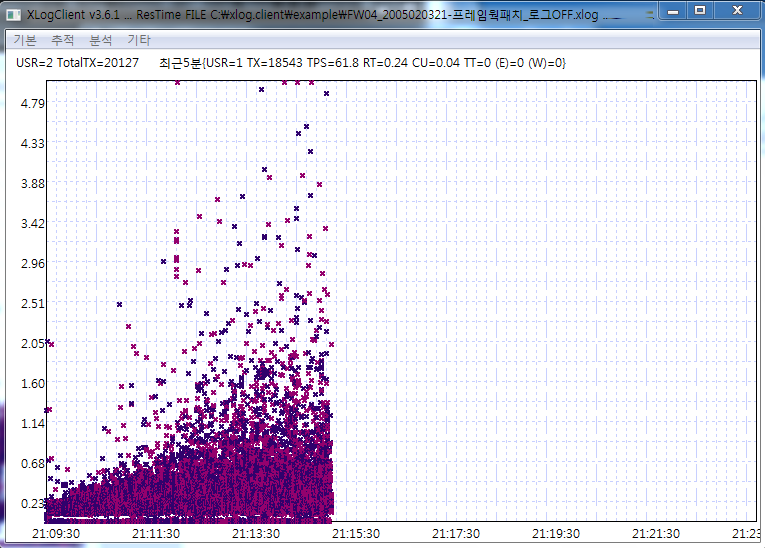

# XLog Case1 - performance issue case while logging on or off
 

When the performance of web applications going bad, We can find these issues with the elapsed time distribution of Scouter and find the solution faster.

This is the elapsed time distribution of Debug log ON and OFF on the framework in a few minutes, with increased load test.

## with Debug log ON

We can see the elapsed time becomes very bad. 
But we cannot point out what is the cause of slow performance with the transaction profiles. 
On this case, the IO makes bad performance with logging. 
Generally logging is on everywhere of transaction not on just one point, so transactions with several loggings responses slower but transactions with one or sometimes loggings go fast.

We call these situations with "floating". The "floating" occurs when a serious slowdown came out. 
On a normal case with increasing load, the xlog shows like Logging OFF pattern. 

## with Debug log OFF

After logging off, the patterns looks like upper. 
Transaction works fine but slow transactions are increasing with increasing load.

The common performance test include only a few applications(urls), so the elapsed time pattern can make a formalized map. 
Please do not ignore these patterns with only targeting the tps or average trap.
