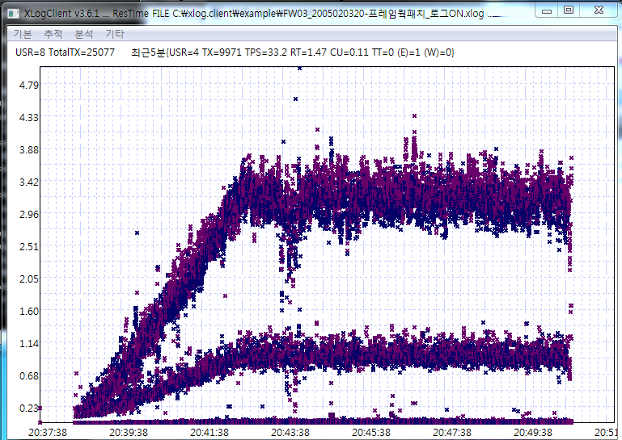
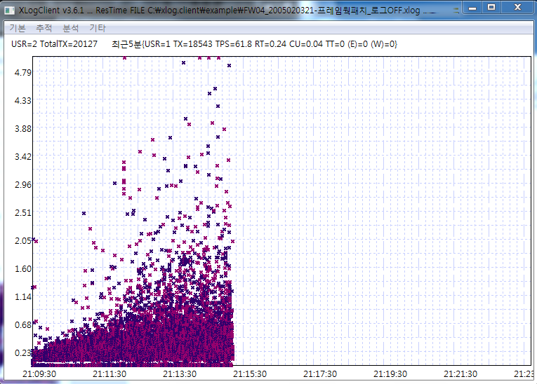

# XLog 사례1 - Logging에 의한 부하 사례
 

웹 프로그램의 성능을 테스트 하다보면 비정상적인 상황이 발생할 수있는데
응답시간 분포를 통해 이들을 빠르게 판단함으로써 문제 해결 시간을 줄일 수 있다.

이번 케이스는 프레임웍에서 디버그 로그를 켰을 때와 오프했을때 응답 패턴이 어떻게 나타나는지를 보여주는 경우이다.

* 짧은 시간(수분) 동안 부하량을 증가시키면서 테스트 했을 때 나타날 수있는 화면이다.

## Logging ON

응답시간이 과도하게 늘어나는 느낌을 받게된다. 그런데 문제는 느린 트랜잭션의 프로파일 내용을 보아도 별다른 응답지연 포인트를 잡기 어려운 경우가 많다. 본 경우에는 로그를 찍음으로써 IO부담으로 응답지연이 발생한 것인데 일반적으로 로그는 트랜잭션의 특정지점이기 보다는
여러곳에서 사용된다 따라서 로그를 많이 남기는 서비스는 위쪽으로 늦어지고 로그를 적게 남기는 서비스는 응답이 아래로 나타난다(빠르다)

들뜬다고 표현하는데 특정서비스의 응답시간이 위 그림처럼 들뜨는 경우는 별로 없다. 대부분 심각한 지연현상이 있을때문
테스트시 응답시간이 들뜨게된다. 정상적인경우에는 부하를 받으면 받을 수록 아래 그림처럼 나타나야한다.
동일 서비스라도 빠른 트랜잭션은 여전히 빠르고 점점 느린 트랜잭션이 나타나서 전체적으로 응답이 펼쳐지는 모양으로 나타난다.

항상 **주의할점은 XLog(응답분포)에서 점의 패턴이 어떤 모양을 형성하는 것은 뭔가 문제를 의심**해야한다.

## Logging OFF

로그를 오프하고 화면처럼 응답패턴이 변하였다.
본 사례는 성능 테스트 중 URL 몇개만을 이용하여 부하테스트를 하기 때문에 응답 패턴이 정형화될 수 있다.(일반적으로 응답패턴이 정형화되는 것은 안 좋은 현상)
단순히 평균의 함정에 빠지거나 잘못된 목표 TPS에 빠져 이상 현상을 간과 할 수 있는 오류에 빠지지 않게 주의해야한다.
