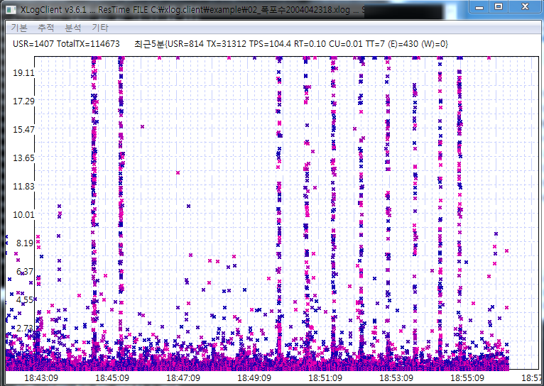

# XLog Case2 - Understanding Waterfalls
 

It is no good sign to make some patterns on XLog(response scatter chart). The most common case is Vertical line occurring.

The vertical line shows some transactions start in different times bue ends together. This means that these transactions hang in some resources and the hanging is ends all together. If these situation went seriously, the transaction spots make a waterfall pattern like this:

On the pattern, transaction ends together with maximum 40 seconds of waiting. 
But just with the profiles, we cannot make the clear solution.

With this pattern, not all transactions makes the waterfall pattern. Only a few transactions is affected with resource lock, the remainders do well.
On the case like this, we must find the common of these waterfall transactions.
*  Are they on the same WAS process?
*  Are they the same applications(urls)?
*  Do they have links in common?
*  Do they link with the same external resource?
*  Is the slowdown point same? (Service starting, middle of the service, end point)
*  Are they called with same client(IP)?

On our situation, we see the 40 seconds time-out. We will find the time-out options on WAS, OS or other external resources and find the linkage with the pattern transactions.

These pictures are captured on same time with different vertical scale(3s, 20s, 50s). It is also important the field of vision, so you have to diagnose in various visions. 
