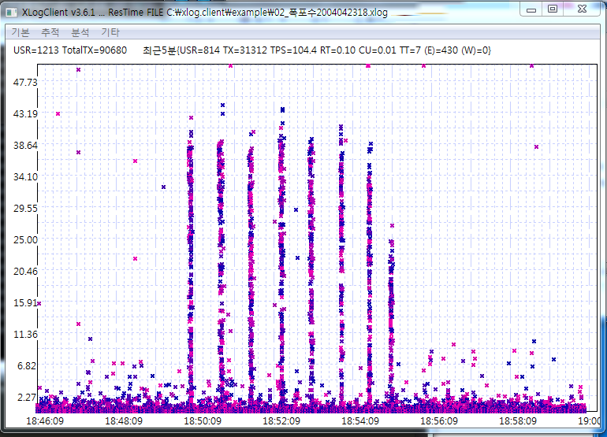
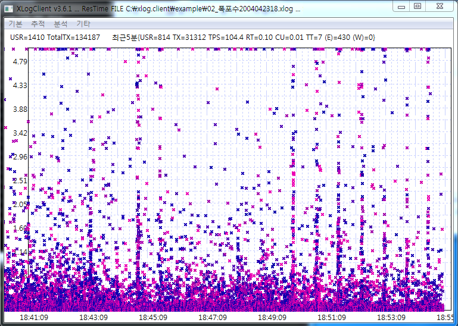
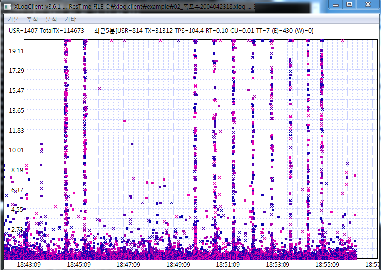

# XLog Case2 - 폭포수 모양에 대한 이해
 

XLog(응답 분포 차트)에서 어떤 패턴이 나타나는 것을 좋지 않다. 
그런데 그중에서도 가장 자주 나타나는 패턴이 세로줄이 만들어지는 것이다. 

세로줄이 만들어졌다는 것은 어떤 트랜잭션들의 시작시간은 서로 다른데 종료시간이 같다는 것을 의미한다.
이것은 트랜잭션이 진행도중에 어떤 락에 걸려 정지하고 있다가
동시에 종료되었다는 것을 의미한다. 그런데 그런 현상이 심각하게 나타나면 
본 예제에 같이  **폭포수처럼 혹은 분수 처럼** 점이 출력된다.

화면에서는 최대 40초까지 락상태에 빠졌다가 동시에 종료되는 모습을 볼 수 있다. 

그런데 이때 이런 패턴이 나타나는 원인을 프로파일 내용을 통해 쉽게 판단할 수 없을 때가 많다.

위 그림에서 보면 모든 트랜잭션들이 락에 영향을 받는 것이 아님을 알 수 있다.
오히려 몇몇 트랜잭션만 락의 영향을 받고 나머지는 정상적으로 처리됨을 알 수 있다. 

따라서 이런 경우에 줄을 형성한 서비스들만 선택하여 그들의 공통점을 유심히 살피는 것이 중요하다.

* 동일 WAS인스턴스에서 실행되었는가?
* 동일 서비스 명을 가지고 있는가?
* 업무적 연관성이 있는가?
* 특정외부서비스와 연관되어있는가?
* 처리 지연 지점이 일정한가?(서비스시작, 중간 혹은 종료시)
* 동일 클라이언트(IP)에서 호출하였는가?

이런 내용들을 보면서 그 연관성을 찾으려고 노력해야한다. 특히 본 사례에서는 약 40초 타임아웃도 있는 것으로 보인다.
WAS나 OS에서 혹은 외부 연계 시스템에서 40초와 관련 있는 옵션들을 찾아보고 그것과
락이 걸린 트랜잭션들과의 연관성을 검토하는 것도 좋은 분석 방법이다. 

본 사례의 그림들은 동일 데이터를 세로 측 스케일만 조절하면서 (3초,20초,50초) 켑쳐한것이다. 
어떤 상태에서 데이터를 보느냐도 중요하기 때문에 응답분포도를 분석할때는 다양한 각도에서 분석하려는 시도가 중요하다.  
