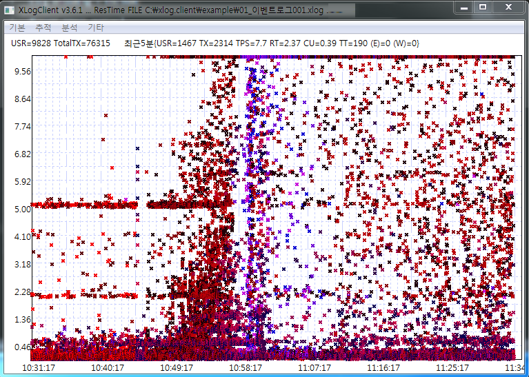

# XLog Case 3 - Understand about Horizontal Pattern
 

One of the well known problem patterns on XLog is markers distributed horizontally. This means some businesses or services have statical response time. Most of cases are waiting time for obtaining usage rights for some resources. For example, assume that waiting time for any resource is 3 seconds. Then the horizontal line will be displayed every 3 seconds (3 sec, 6 sec, 9 sec, ...).

And the line also will be appeared explicit sleep time to simulate the communication time for interaction with external system.

In old time application logic was implemented with explicitly postponing algorithm due to the shortage of computational power or resources. Now a days, it is very rare cases because making system more powerful is easy.

Because horizontal line means problem, it must be analyzed.
