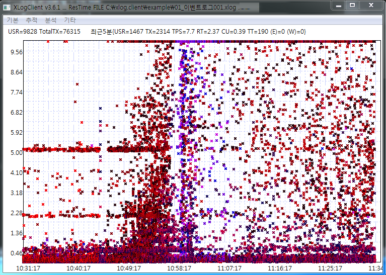

# XLog Case3 - 수평 라인 형태의 이해
 

응답 분포 차트(XLog)에 나타나는 대표적인 패턴 중 하나는 가로 라인이 나타나는 것이다.  
가로 라인은 트랜잭션의 처리 중 자원 획득 시 Wait 값과 같은 일정한 지연이 있을 때 발생한다.
예를 들어 어떤 자원을 조회하고 실패하면 3초 기다렸다 다시 조회하는 경우 3초, 6초, 9초의 지연이 발생하고
화면에서는 3초 간격의 라인이 형성된다.

또는 테스트 할 때 외부 연계를 시물레이션하기 위해 일정시간의 Sleep 을 걸어두는 경우에도 라인이 형성될 수 있다.

과거에는 단시간에 시스템의 처리 능력을 향상시킬 수 없어서 고의적으로 처리 지연을 유도하는 경우도 있었지만 최근에는 IaaS 환경과 같이 지연 처리하지 않고 자원을 바로 늘리는 방식을 택한다. 

가로 라인이 만들어진다는 것은 원인이 항상 존재하며, 운영자는 가로라인이 관찰되면 반드시 그 원인을 파악하고 개선해야 한다.
